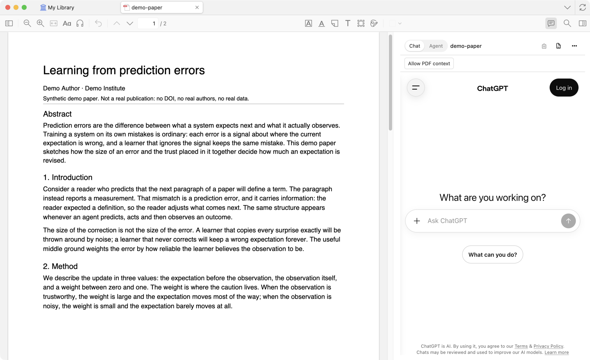
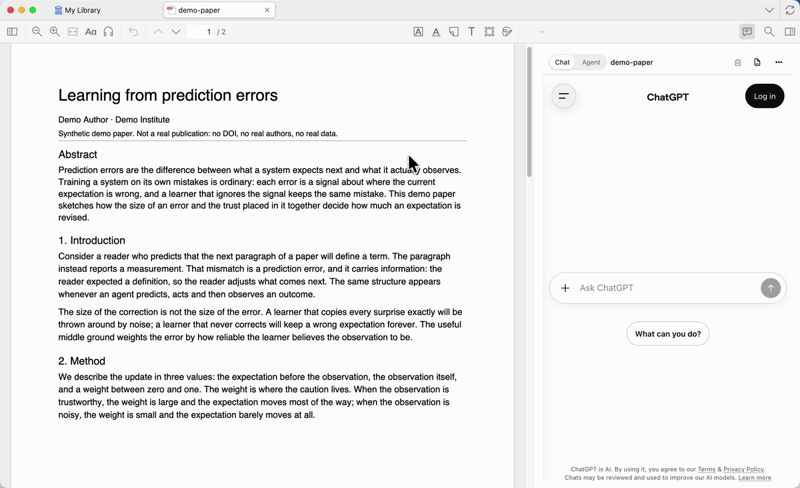
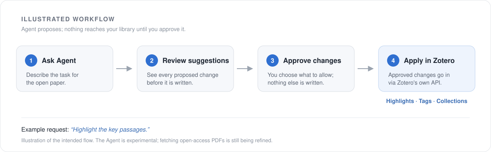

# zotero-chatgpt

**Read papers. Stay in Zotero.**

ChatGPT for your papers. An Agent for your library.

## Ask your paper

Explain a passage, unpack a derivation, or ask a follow-up—right beside your PDF. Chat uses the official ChatGPT website, with available text from your current paper included by default. You can turn automatic context off.

> “What is the key idea behind this method?”

*Bring a passage into your question. Shown before sending.* [View still image](docs/media/chat-demo-poster.png)

## Put Agent to work

Highlight key passages. Organize selected papers with tags and collections. Preview and approve changes before they reach your library.

> “Highlight the five most important passages and explain why.”

*Illustrated workflow.*

Agent is experimental; fetching open-access PDFs from a DOI or article link is still being refined.

## Get started

Install the `.xpi` in Zotero → open a PDF → open the sidebar → sign in.

**Chat needs no API key and uses no Codex quota.**
Agent uses Codex quota and requires separate sign-in.

_Early preview · macOS (Apple Silicon) · Zotero 9.0.6._

---

Independent community project. Not affiliated with or endorsed by Zotero or OpenAI.
