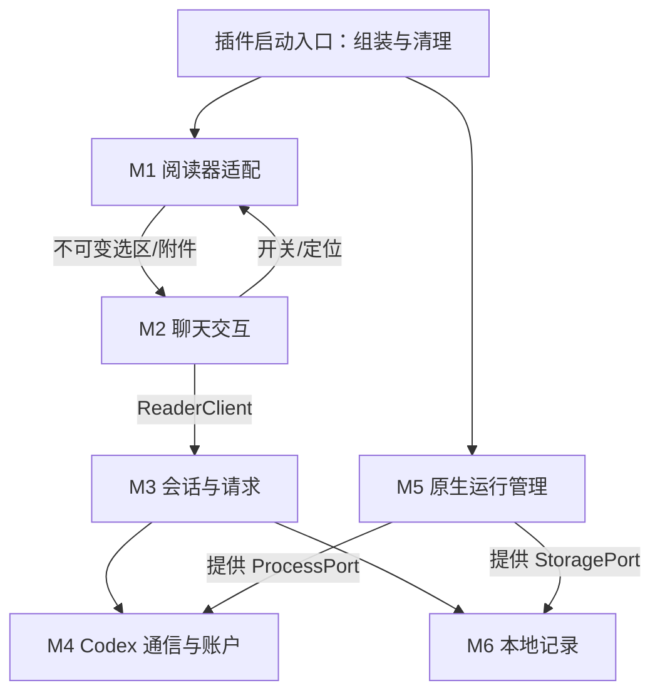

# Zotero Codex Reader：模块设计

状态：本文描述完整目标设计；S0–S6 开发预览已在专用宿主落地，S7 仅有 dry-run。当前进度见 [progress](progress.md)。技术路线遵循[项目决策](project-decisions.md)，公共类型以 `packages/contracts` 为准，恢复与 Codex 适配语义见[接口约定](superpowers/plans/2026-09-08-zotero-codex-reader-contracts.md)。

## 1. 从使用流程划分职责

一次“选中文字 → 解释”的操作至少包含六种变化：读取 Zotero 当前选区、改变阅读器布局、组织用户请求、调用 Codex、处理异步回复、保存记录。把这些放在一个侧栏脚本中，会使界面重绘影响请求生命周期，也使每次改 Zotero 版本都要触及聊天逻辑。

因此采用 **六个运行模块，加一个构建发布模块**。模块是职责划分，不等于七个进程或七个独立包。运行时仍只有 Zotero 插件和它管理的 Codex 子进程；Node 只在开发机上构建与测试。

## 2. 模块总表

| 模块 | 负责什么 | 调用方使用的接口 | 内部隐藏的复杂性 | 完成后如何验证 |
| --- | --- | --- | --- | --- |
| M1 阅读器适配 | 当前附件、选区、工具栏入口、原生停靠、PDF 缩放与引用定位 | `captureSelection`、`openCitation`、`ReaderLayoutController` | 父文献/附件区别、PDF/屏幕坐标、宿主 DOM 和版本差异、原生面板恢复 | 在真实 Zotero 捕获正确选区、按钮位置正确、开关后阅读位置保持 |
| M2 聊天交互 | 引用卡、草稿、输入框、模型设置、回答显示与焦点 | `ConversationPresenter` 的 activate/addCitation/explain/send/cancel/setSettings | 视图渲染、输入法、草稿保存、滚动策略、公式与主题 | 使用可控 ReaderClient，验证两个选区动作和连续界面状态 |
| M3 会话与请求 | 附件到会话的归属、请求顺序、去重、事件状态与恢复 | `ReaderClient` 的 current/newConversation/send/request/cancel/get/subscribe | 请求日志、并发排他、seq 去重、uncertain 对账、消息状态迁移 | 正文/补充 PDF 不串话，双击不重复请求，恢复不重新提交 |
| M4 Codex 通信与账户 | App Server 握手、官方登录、模型能力、轮次与事件转换 | 内部 `CodexClient` | JSONL 拆包、request ID、服务端请求、账户通知、模型/速度/推理映射 | 假进程协议测试，再做真实官方登录、输出与取消 |
| M5 原生运行管理 | 自带 Codex 校验/提取、原生启动、进程退出、插件全局生命周期 | `RuntimeSupervisor.ensureStarted/stop`，注入 `ProcessPort` | 原生句柄、UTF-8 流、stderr 排空、有限重启、平台路径与运行配置 | 一个插件实例只创建一个自有后台；关闭侧栏不丢回答；停用能收尾 |
| M6 本地记录 | 对话快照、请求日志、草稿、设置与版本化恢复 | `ConversationRepository`、`StoragePort` | 原子替换、日志顺序、坏尾记录、迁移和路径限制 | 强制退出后内容可恢复；损坏文件保留证据，不覆盖为空 |
| M7 构建与发布 | 编译、开发加载、合成材料、XPI、CI、升级与许可清单 | npm scripts 和构建资产 | 开发/生产配置区别、固定 runtime 获取、平台包、hash、无个人数据 | 干净 checkout 构建，干净 Zotero 从完整 XPI 安装成功 |

`ReaderClient` 是 M3 对 UI 的统一接口，其中账户和模型读取委托 M4；UI 不需要知道进程何时创建或如何解析 JSON。模块内部可以分多个文件，但不为单行转发建立额外“管理器”。

状态唯一负责人：M1 管当前阅读 view 的选区/缩放/布局；M2 管未提交草稿和 UI；M3 管已提交消息、requestId 与事件状态；M5 管原生进程寿命。M2 不能自己维护另一套“上游是否已发送”的记录，也不接触 Codex threadId 或原始文件/进程句柄。

## 3. 代码落点和依赖方向

```text
packages/
  contracts/          共享业务类型、能力端口、输入校验
  core/
    sessions/         M3 会话与请求、快照/请求日志（store.ts、log.ts）
    codex/            M4 协议、账户、模型能力
  zotero/
    reader/           M1；实际源码位于 src/reader/
    chat/             M2；实际源码位于 src/chat/（presenter 持有未提交草稿）
    runtime/          M5 与 M6 Gecko 存储适配；实际源码位于 src/runtime/
scripts/              M7 开发、编译、打包和验证
tests/                对应模块的行为与集成测试
```

上述是逻辑分布。会话快照与请求日志在 `core/src/sessions/`，不预先抽出空的 persistence 目录。



图中最后一条是业务操作调用；实现时 M1 通过回调向上报告选区，M2 通过注入的阅读器接口请求布局，不建立相互 import。`bootstrap/index` 是组装入口，负责接线，不扩展成另一个业务模块。

固定依赖规则：

- core 可以依赖 contracts，不能 import Zotero、DOM、Gecko 或 `node:*`。
- zotero 可以依赖 core/contracts，具体原生 API 仅出现在其适配文件。
- tests 可以使用 Node 假进程/临时文件适配器；这些文件不能进入生产 bundle。
- UI 只通过 ReaderClient 提问和订阅，不直接访问 Codex stdin、进程句柄或认证文件。
- ProcessPort 与 StoragePort 有真实的两个使用环境：Gecko 生产适配和 Node/内存测试适配，因此有必要保留这两个可替换接口。

## 4. 各模块的关键设计

### M1：让 Zotero 的复杂细节停在阅读器适配内

保存的论文身份使用 `clientId + libraryId + attachmentKey`；数值 itemID 只用于当前运行时定位。选区回调立刻复制文字和位置，避免点击按钮或开侧栏后原生选区消失。

工具栏开关、选区上方操作条、原生右侧区域的协调都由 M1 处理。M2 只表达“显示聊天”或“回到引用”，不操作宿主的 collapsed 属性或 PDF 缩放变量。

尺寸变化使用当前 PDF 坐标锚点；关闭时保持当前阅读页，不回到打开时的旧页。原生内部接口集中在适配文件，宿主升级时在这里验证和修复。

### M2：展示状态和用户意图

把“引用还在草稿”“请求已经接受”“正在输出”“已取消/失败/不确定”做成不同状态。Ask in sidechat 只放入引用；More details 生成一个解释意图，实际发送交给 M3。

模型/速度/推理设置保存在待发送草稿中；每次发送生成不可变快照。已提交消息的设置标签不能被后续菜单修改。早期用纯文本渲染，流式链路正确后加入 Markdown/公式和原生视觉细节。

### M3：一个地方决定“这条问题到底有没有发过”

最小去重和提交记录必须在第一条真实模型请求之前实现。它们不能推迟到最后的“稳定性优化”，否则双击、重连就可能重复提交。

采用 `requestId + 内容 hash`；提交前记录意图，写入上游前记录 dispatching，获得 turnId 后记录 running。无法确认是否执行时保留 uncertain，先对账，不自动新发。详细规则沿用接口文档。

早期仅需支持当前附件的一条对话，但附件身份从第一版就正确。后续增加多对话列表和重启后的恢复，不更换主键设计。

### M4：把 Codex 当作有状态协议，而非一次 HTTP 请求

UI 不拼接原始 JSON-RPC。握手、登录、模型目录、每轮参数、增量与终态在 M4 标准化；普通文字与内部 reasoning 不混合展示。

速度和推理强度分别映射到服务端真实字段。配置一旦冻结到本轮请求，切换控件只作用于下轮。模型目录能显示某型号，不被解释为账户额度一定可用。

### M5：后台寿命独立于侧栏寿命

插件启用时组装全局监督器，视图需要使用时调用 ensureStarted。重复调用复用同一实例；只有停用/卸载/退出或明确进程故障才收尾或重建。

原生运行目录和 Codex 登录状态属于插件，避免污染开发用 Codex。只启动已校验的自带可执行文件；原生启动与平台安全行为从早期就使用真实 XPI 验证，不等到功能完成才首次打包。

### M6：先有最小可靠记录，再扩展历史管理

早期实现必需的请求日志、附件映射和当前对话记录；S5 已补上每附件历史、JSONL 请求日志坏尾恢复和 schema 拒绝写入。核心对“写入成功”的解释必须由 Gecko 适配器实测支持。

正文记录与可分享诊断分开。诊断仅包含允许字段；错误处理不会自动打包原文、账户信息或完整进程输出。

未提交草稿由 `ConversationPresenter` 按附件/会话保存在内存中，关闭侧栏不丢失，也不写入 StoragePort。已提交对话与请求日志只走 M3 的 `ConversationStore`。二者不能分别维护“是否已发送”。UI 不得取得任意文件读写能力。

### M7：开发循环与发行链路同时存在

开发使用 watch 编译和独立 Zotero profile，缩短 UI 调试周期；发行使用完整 XPI 和固定 Codex 资产。前者成功不能替代后者。

CI 的假上游测试可以无账户运行；真实登录/生成和原生宿主测试显式执行，并记录范围。整个开发过程中都保留可构建状态，最终阶段主要扩大验证矩阵和准备公开发行。

## 5. 两条主功能的调用链

**More details：** M1 复制选区 → M2 展开侧栏、冻结引用与设置 → M3 校验和持久化请求 → M4 启动本轮 → M3 保存事件 → M2 显示。若未登录，先完成 M4 官方授权，再恢复同一个尚未提交的意图。

**Ask in sidechat：** M1 复制选区 → M2 展开侧栏、加入草稿并聚焦输入 → 用户发送 → 进入相同的 M3/M4 流程。点击 Ask 本身不产生模型请求。

关闭侧栏只撤销 M2 订阅；M3/M4/M5 继续保存已有请求。重新打开时先订阅缓存事件，再读一致快照，避免重复显示或漏掉增量。

## 6. 当前不提前建设的内容

首版不做通用 AI 提供商框架、整库向量检索、网络中转服务、独立桌面壳或复杂数据库服务。文件只在对应阶段确实需要时创建；保留明确职责，不预先铺满几十个空类。

下一步执行顺序见[分阶段实施计划](superpowers/plans/2026-09-08-zcr-implementation-stages.md)。
