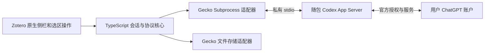

# Zotero Codex Reader：项目决策

日期：2026-09-08。状态：名称、技术路线和开发流程已收敛；S0/S1 开发预览已实现，实际验收状态见 [开发进度](progress.md)。本文取代早期 Node companion + HTTP 中转的技术假设，用户交互要求保持不变。

## 1. 项目名称与目标

| 项目 | 决定 |
| --- | --- |
| 正式名称 | **Zotero Codex Reader** |
| 简称 | **ZCR**，用于代码和内部讨论 |
| GitHub 仓库名 | **`zotero-codex-reader`** |
| 中文说明 | **在 Zotero 内使用 Codex 阅读和讨论论文** |
| 项目定位 | 社区开发的 Zotero 阅读插件，说明与 Zotero/OpenAI 无官方隶属关系 |
| 首个测试版本 | 当前开发预览 `0.2.0-alpha.1`（XPI `0.2.0a1`）；通过发行验收后再发布 `0.1.0` |
| 仓库状态 | 名称已选定，尚未创建远程仓库，也不声称名称独占或已注册 |

这个名称同时说明宿主、后端和使用场景，适合 GitHub 搜索、README 与用户安装列表。仓库名固定，GitHub owner 在实际创建仓库时选定；扩展 UUID `{8a5f5bde-b4e1-41eb-b5d9-2774afa0cf72}` 已生成并保持稳定，不随仓库地址变动。

## 2. 技术路线

### 固定选择

| 层 | 选择 | 依据 |
| --- | --- | --- |
| 产品宿主 | Zotero 9 原生 bootstrap 扩展 | 使用已有阅读器、工具栏、注释和右侧区域 |
| 界面 | TypeScript + 原生 DOM/CSS + Zotero 主题 | 满足截图中的原生风格与停靠/缩放行为 |
| 会话核心 | 平台无关 TypeScript | 同一套状态机可在 Node 测试、在 Gecko 运行 |
| AI 后台 | 固定版本 `codex app-server` | 官方会话、模型能力、流式输出和 ChatGPT 授权接口 |
| 进程通信 | Zotero `Subprocess.call()` + stdio JSONL | 本机源码已验证存在启动、读写管道、等待和终止能力 |
| 平台隔离 | ProcessPort / StoragePort | 核心不依赖 Node/Gecko；平台细节集中在适配器 |
| 存储 | 插件专用目录的版本化 JSON 快照与请求日志 | 保留附件会话、幂等和崩溃恢复；持久化语义需 T0 核查 |
| 回答渲染 | markdown-it + DOMPurify + KaTeX | Markdown/公式与不可信内容处理，资源随包 |
| 开发构建 | Node.js 24 + npm workspaces + esbuild | Node 是开发工具，不是用户额外安装要求 |
| 测试 | Vitest + 假进程/存储适配器 + 真实 Zotero profile | 区分核心逻辑、原生宿主和完整发行物验证 |
| 分发 | 含 Codex 运行组件的完整平台 XPI | 用户下载插件、安装、浏览器登录后阅读 |

核心服务在插件生命周期内由一个全局实例持有；侧栏视图可反复开关，Codex 进程和已接受请求不会因视图销毁而丢失。禁用插件或退出 Zotero 时，停止插件自有进程并按明确终态/不确定状态保存记录。

### 对早期方案的收敛

早期 Node companion 负责的协议、存储、会话和恢复功能移入 TypeScript 核心及 Gecko 适配层。移除本项目自建 HTTP 服务、端口配对和额外 Node 运行时打包；Codex 官方 OAuth 可能仍使用自己的本机回调服务，这是授权流程的一部分。

选择直接路线的机制依据是：Zotero 本身已有 JavaScript 运行环境、特权异步进程管道和文件 API。独立 Node 中转原本提供的主要是开发生态便利，不是保留聊天或调用 Codex 所必需的运行边界。

### 尚需真实验证的部分

源码已经确认能力入口，但还不能据此声称完整插件可用。T0 优先验证（2026-09-09 状态见 [S2 QA](qa/s2.md)）：

1. 实际下载的 XPI 提取并启动匹配架构的 Codex，路径含中文/空格时正确，操作系统安全检查可正常通过。——已在专用 Zotero 9.0.6 用开发 XPI 验证提取、hash 校验与原生启动；含中文/空格路径与下载来源的隔离属性仍待 S6。
2. UTF-8 拆包、逐行 JSON、EOF、取消和进程退出全部可控；不把一次 pipe read 当成一条消息。——单元测试与宿主握手已验证；真实取消（`turn/interrupt`）待限额恢复后验证。
3. 插件内发起官方浏览器登录，独立账户状态不影响开发用 Codex。——专用 `CODEX_HOME` 内的登录状态可跨重启恢复，且 `config/read` 门确认没有继承其他配置层；插件内点击登录的自动化流程待 `--login` 运行。
4. 文件快照原子替换和请求日志的持久化语义可支撑不确定提交恢复；不能靠函数名推断落盘保证。——停用/重启后请求记录以相同 ID 与终态恢复且不重发；掉电语义未证明。
5. 模型、速度、推理强度在同一个对话下一轮生效。——S4；已证实 0.144.1 把请求的 `null` 档位回显为 `"default"`。

如果原生接口存在阻断问题，先修复适配器并记录证据；若确实必须改变运行架构，更新本文和三个计划文档，不静默恢复另一套实现。

## 3. macOS 开发基线

本轮读取本机环境确认：

| 项目 | 当前值 | 用途 |
| --- | --- | --- |
| 架构 | Apple Silicon / arm64 | 首轮真实宿主与发行验证 |
| Cursor | 3.14.27 | 日常编辑、差异审查与终端 |
| 官方 Codex 扩展 | `openai.chatgpt` 26.901.22334 | Cursor 内的主要编码代理；已找到安装目录 |
| Codex CLI | 0.144.1 | 开发调试和初始 App Server schema 基线 |
| Node | 24.11.0 | 构建和测试 |
| Zotero | 9.0.6 | 已在本轮规划中核对的宿主版本 |

初始支持目标为 **macOS Apple Silicon**。Intel Mac 需要独立打包并通过相同的真实安装/启动验收后加入支持；Windows/Linux 属于后续平台。开发操作系统是 macOS，不代表必须承诺每种 macOS/CPU 组合均已可用。

发行物使用固定且验证过的 Codex 构建，开发用扩展/CLI 的自动更新不直接决定插件后台版本。保留原生二进制原有签名、许可证/NOTICE 和校验清单；平台签名、隔离属性及实际下载后的启动行为在发行流程中检验。

## 4. Cursor + Codex 的工作方式

**主工作台：Cursor；主编码代理：Cursor 内的官方 Codex 扩展；运行与验收宿主：独立开发 Zotero。** 官方文档列出 Cursor 为支持的编辑器，当前机器也已安装该扩展。[Codex IDE 文档](https://learn.chatgpt.com/docs/codex/ide)

| 使用者/工具 | 默认职责 |
| --- | --- |
| 用户 | 决定交互、查看差异、在 Zotero 真实试用和验收 |
| Cursor 编辑器 | 浏览/编辑代码，定位类型错误，查看 diff 和测试输出 |
| Codex 扩展 | 按一个已定义任务实施、运行相关检查、修复问题并说明证据 |
| Codex CLI | 辅助可重放调试和终端工作；与 IDE 任务避免并发写同一 checkout |
| Cursor 自带 AI | 可选局部补全或独立审阅；审阅默认只读，不同时接管同一文件 |
| Zotero 开发 profile | 验证真正的选区、侧栏、缩放、焦点和插件生命周期 |

对话上下文通过仓库文档衔接，不假设不同工具自动共享聊天历史。项目共用一个根 `AGENTS.md`；需要 Cursor 专属规则时，仅用短规则引用主规范，不维护两份容易冲突的要求。Cursor 官方支持 AGENTS.md 作为项目规则入口。[Cursor 规则文档](https://cursor.com/docs/rules)

## 5. 开发流程

模块职责见[模块设计](module-design.md)，实际执行顺序见[分阶段实施计划](superpowers/plans/2026-09-08-zcr-implementation-stages.md)。T0–T12 保留为工作包细则；原生验证随阶段进行，不放在仓库初始化之前整包执行。

| 阶段 | 重点 | 可检查成果 |
| --- | --- | --- |
| S0 | 仓库与基础工程 | 本地 Git、共享 AGENTS、工具链与可构建入口 |
| S1 | Zotero 外壳和布局 | 搜索旁按钮、真实停靠侧栏、基础 PDF 适配 |
| S2 | 自带 Codex 和登录 | 官方授权、合成问题真实回复与停止、最小提交保护 |
| S3 | 主功能闭环 | 选区解释/提问和同附件连续对话 |
| S4 | 完整交互 | 模型/速度/推理、公式、原生样式与布局细节 |
| S5 | 历史与恢复 | 多对话、进程恢复和故障对账 |
| S6 | QA 与发行候选 | 30 项验收、干净环境完整 XPI |
| S7 | GitHub 发布 | 源码、文档、CI 与公开版本 |

日常循环固定为：选一个任务 → Codex 修改并运行针对性检查 → 用户在 Cursor 看 diff → 构建并在 Zotero 试用 → 修复/验收 → 提交。任务间用小提交隔开；同一 checkout 同一时刻只有一个写入负责人。

只有明确可并行的 UI/核心任务使用独立 worktree，例如 `codex/s4-reader-ui` 与 `codex/s5-session-recovery`；共同契约先定稿，合并前各自通过检查。不同 worktree 不同时写同一开发 profile/data directory。

## 6. 下一步

先完成 S0 仓库/工程初始化与 S1 真实 Zotero 外壳，然后进入 S2 的自带 Codex/官方登录。最小去重和提交记录在真实发送前建立，T0 的对应验证穿插进行。当前已实现工程、工具栏、侧栏开发预览以及随包 Codex 运行、阅读策略门、账户状态和合成请求的提交与记录；真实流式回复与停止待测试账户限额恢复后验证，随后进入 S3。

详细日常操作见[macOS 开发流程](development.md)，完整任务见[开发计划](superpowers/plans/2026-09-08-zotero-codex-reader.md)。
