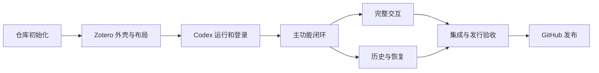

# Zotero Codex Reader 分阶段实施计划

> **For agentic workers:** Use superpowers:subagent-driven-development or superpowers:executing-plans to execute one bounded stage at a time. Track completion with `- [ ]` checkboxes and actual evidence.

**Goal:** 从当前只有规划文档的项目目录出发，逐步得到能在 macOS Zotero 内安装、登录和阅读聊天的插件，再形成可公开发布的 XPI。

**Architecture:** 六个运行模块分别负责阅读器适配、聊天交互、会话请求、Codex 通信、原生运行管理和本地记录。Zotero 通过 Gecko 原生 stdio 管理自带 Codex；Node 只用于构建和测试。

**Tech Stack:** macOS Apple Silicon、Cursor + 官方 Codex 扩展、TypeScript、npm workspaces、esbuild、Vitest、Zotero 原生界面、Codex App Server。

**Spec:** [模块设计](../../module-design.md)、[项目决策](../../project-decisions.md)、[用户流程](../../zotero-codex-user-flow.md)、[接口约定](2026-09-08-zotero-codex-reader-contracts.md)、[验收矩阵](2026-09-08-zotero-codex-reader-acceptance.md)。

## Global Constraints

- 起始状态：只有 README 和规划文档。2026-09-08 已完成 S0/S1 开发预览及基础宿主验证，见 [progress](../../progress.md) 和 [QA](../../qa/s0-s1.md)。
- 正式目录为 `/Users/kuhn/Desktop/ZoteroCodexReader`。所有开发命令先确认该目录，避免回到原规划目录写代码。
- 用户安装一个完整平台 XPI 后，通过官方浏览器登录 ChatGPT；正常用户不安装 Node/CLI，不操作终端或配对码。
- UI 保持 Zotero 原生风格；搜索旁开关、选区上方操作条、原生标注共存、PDF 自适应都属于首版要求。
- 同一对话可选择模型、速度和推理强度，下一条请求生效。
- 真实请求发出前已有最小去重、附件隔离和提交记录；完整恢复可以后续加强，但不能先放任重复提交。
- 每阶段只把实际完成的检查标为通过；模拟后端、源码加载和真实发行安装分别记录。

---

## 1. 如何使用这份计划

**S0–S7 决定执行顺序，原 T0–T12 是实施细则与验收参考，不再按 T0 → T1 → T2 机械执行。**

原 T0 集合了很多宿主和协议验证，其中一些需要先有工程和功能才能验证。现把它们放入对应阶段：S1 验证原生布局，S2 验证进程/登录/持久化前提，S3 验证真实选区请求，S5 验证完整恢复，S6 验证实际下载的发行物。

每个阶段可拆成数个小提交。一个阶段交付可检查的成果后再进入依赖它的下一阶段；检查失败先修复，不靠把状态写成“基本完成”继续堆功能。

## 2. 阶段总览

| 阶段 | 重点 | 用户能看到的成果 | 依赖 |
| --- | --- | --- | --- |
| S0 | 仓库与工程初始化 | 可用的项目结构、构建和开发入口 | 当前规划 |
| S1 | Zotero 插件外壳与基础布局 | 工具栏按钮可打开真实停靠侧栏，PDF 基础适配 | S0 |
| S2 | Codex 运行与官方登录 | 从实验 XPI 自动启动 Codex、登录、返回合成问题的回复 | S1 |
| S3 | 主功能最小闭环 | 选中文字 → More details / Ask → 回答和连续追问 | S1 + S2 |
| S4 | 完整聊天交互与原生体验 | 模型/速度/推理控制、公式、拖宽、边缘避让等 | S3 |
| S5 | 历史与恢复完善 | 多对话历史、重启恢复、故障对账与完整内容保护 | S3，随后与 S4 集成 |
| S6 | 集成验收与发行包 | 30 项验收记录，干净环境可安装的完整 XPI | S4 + S5 |
| S7 | GitHub 公开发布 | 有源码、文档、CI 和下载资产的 prerelease/stable release | S6 |



## 3. S0：仓库和基础工程初始化

**涉及模块：** M7，最小 contracts 与插件入口。**对应细则：** T1 的工程部分。

**创建/更新文件：** 根 `.gitignore`、`AGENTS.md`、`package.json`、lockfile、`.nvmrc`、TypeScript/ESLint/Vitest 配置；三个 packages 的 package.json；最小插件 manifest/bootstrap/entry；`scripts/build.mjs`、`scripts/dev.mjs`。其他业务文件等使用时创建。

- [x] 再次确认项目路径、文件清单和 Git 状态；保留已有 README/docs。
- [x] 初始化本地 Git，建立 `.gitignore` 和根 AGENTS，提交现有规划基线。
- [x] 建立 `codex/s0-bootstrap` 功能分支；后续并行 worktree 以这个有提交的仓库为基础。
- [x] 配置 npm workspaces 与 TypeScript strict；Node 版本固定在开发基线，依赖写入 lockfile。
- [x] 建立能编译的最小插件入口和稳定扩展 UUID，不一次生成所有空业务类。
- [x] 建立 build/dev/typecheck/lint 命令。Vitest 配置就绪，出现真实行为测试后启用对应 test 脚本，不用空测试套件宣称功能通过。
- [x] 构建一次，再从 lockfile 重新安装验证开发依赖可复现；记录实际命令与结果。

已执行的 Git 初始化顺序：

```sh
git init -b main
git add README.md docs .gitignore AGENTS.md
git commit -m "docs: establish Zotero Codex Reader project baseline"
git switch -c codex/s0-bootstrap
```

Git 作者信息若缺失，在真正提交前明确处理，不伪造用户身份。此阶段不创建远程仓库或 push。

**交付标准：** 目录已成为正确的本地 Git 仓库；开发分支存在，lockfile、构建和类型检查有效；尚不把空插件入口说成用户功能。

## 4. S1：可加载的 Zotero 外壳与基础侧栏

**涉及模块：** M1/M2 外壳、M7 开发打包。**对应细则：** T2 的入口/基础布局、T4 的生命周期，T0 的宿主验证。

**文件重点：** `packages/zotero/src/index.ts`、reader/{toolbar,reader-pane,layout}.ts、chat/view.ts、assets/sidebar.css、locale 文件；`scripts/package.mjs` 的开发包模式；toolbar/layout 测试。

- [x] 创建独立 Zotero profile 与 data directory，导入自制 PDF；这一环境只用于开发。
- [x] 建立 `npm run package:dev`，生成标明开发用途的 XPI，安装后验证启用、停用和卸载钩子。
- [x] 在搜索左侧增加原生风格按钮，打开基础聊天区；允许固定合成内容用于验证布局，但明确标为开发预览。
- [x] 证明它是参与真实宿主布局的停靠区域：打开后 PDF 视口变窄，关闭后恢复。
- [x] 验证基础原生缩放和当前阅读页/锚点可保持，原生信息/笔记区域不会被破坏。
- [x] 记录当前附件身份，特别验证同一父条目下两个 PDF 不能混用；此时还不调用模型。
- [x] 三轮启停无重复按钮或监听器；在真实 Zotero 中记录 G1 的基础证据。

**交付标准：** 用户可以在 Zotero 点击按钮打开和关闭正确位置的侧栏，真实 PDF 布局成立。不能只用浏览器页面或截图模拟达到这一阶段。

**开发包边界：** 此时 XPI 可以尚不包含 Codex；它仅验证宿主外壳，不作为公开可用安装包。

## 5. S2：自带 Codex、官方登录和最小协议闭环

**涉及模块：** M4/M5、M3 最小请求保护、M6 最小记录与 M2 登录状态。**对应细则：** T5/T7，T6 最小提交记录，T0 原生运行验证。

**文件重点：** core/src/codex/{client,account,events,reader-policy}.ts；core/src/sessions/{service,request-journal}.ts 的最小请求路径；zotero/src/runtime/{supervisor,process,storage,paths}.ts；account/controller.ts；runtime 清单、Codex 资产构建、JSONL/运行时测试。

- [x] 先用可控 ProcessPort 验证握手、UTF-8/JSONL 拆包、EOF、请求与响应相关和退出。（`tests/core/transport.test.ts`、`tests/core/client.test.ts`；原生解码见 `tests/runtime/process.test.ts`）
- [x] 实验 XPI 内加入固定 Codex 资产；在插件目录内验证 hash、提取并通过原生 Subprocess 启动，不能用开发机已安装的 CLI 路径充当这一验收。（2026-09-09 专用 Zotero 9.0.6 宿主：`native-runtime-handshake-ready`、`one-owned-codex-process`）
- [x] 确立插件专用运行/账户状态和启动前的阅读策略，检查非预期工具/配置继承。（`config/read` 有效配置/层/来源门与专用 `CODEX_HOME` 交叉检查在宿主通过；实际 0.144.1 形状由隔离探测确认）
- [ ] 在侧栏提供“使用 ChatGPT 登录”，打开官方浏览器授权页；成功、取消、超时都回到明确界面状态。（界面与核心状态机已实现并有单元回归；宿主上登录状态可跨重启恢复，但点击登录→浏览器授权的 `--login` 流程尚未在宿主驱动中运行）
- [x] 在第一条真实合成请求前，验证最小 requestId、一次活动请求限制、提交日志写入顺序及 stdout 故障后的 uncertain 状态。（`tests/core/journal.test.ts`、`tests/core/client.test.ts`；宿主重启后以相同 ID/终态恢复且不重发）
- [ ] 提交一个明确标为合成测试的问题，逐步显示真实回复，再验证停止、退出收尾和重复启动复用。（`turn/start` 已真实提交并到达模型后端，上游以“usage limit”拒绝并按类型化原因显示；真实回复与停止待账户限额恢复；退出收尾与重复启动复用已通过）
- [x] 验证基本模型目录可读取；其完整菜单与同会话设置切换在 S4 完成。（真实目录 7 个模型，默认 `gpt-5.6-sol`，默认档位 `null` 回显为 `"default"`）

**交付标准：** 从实验 XPI 自动运行自带 Codex，用户在插件中发起官方登录，能看到真实流式回复并停止。不会复制认证文件，不用假回复代替成功。

**2026-09-09 状态：** 见 [S2 QA](../../qa/s2.md)。12/12 已执行宿主检查通过；真实回复、非空输出与停止三项因测试账户的 Codex 周限额用尽（2026-09-15 恢复）保持 NOT RUN。限额恢复后重跑 `node scripts/prepare-host-test.mjs --s2` 即可补齐，无需改动实现。

**门槛：** 阅读策略、原生进程或最小提交记录未成立时，不开放 S3 真实论文发送。完整平台下载来源、升级回退矩阵在 S6 扩大验证，不能因此省略这里的随包原生启动。

## 6. S3：主功能最小可用闭环

**涉及模块：** M1/M2/M3/M4/M6。**对应细则：** T2 选区、T3 请求流程、T6 基础归属、T9 初次集成。

**文件重点：** reader/{selection,selection-actions}.ts；chat/{draft,controller}.ts；core/src/sessions/{service,repository,request-journal}.ts；selection/draft/request/integration 测试。

- [ ] 单页选区生成不可变引用：原文、附件 key、页码标签、页面索引、位置和可用元数据。
- [ ] 正常选区上方显示 More details / Ask in sidechat，下方原生标注面板保持可用。
- [ ] More details 自动打开侧栏并提交一次解释；Ask 仅放入引用、聚焦输入框，用户发送后才请求模型。
- [ ] 当前附件绑定真实 conversation/thread，支持同一对话的第二次、第三次追问。
- [ ] 实现基础内容保存、重复点击去重和全局生成生命周期；关闭侧栏继续接收，重新打开恢复已保存内容。
- [ ] A 生成时切到 B，不把增量显示或保存进 B；关闭/切换后不读取过期选区。
- [ ] 进程异常后明确不确定状态，保留问题；尚未完成自动对账时也禁止自动重发。

**交付标准：** 用户能实际读一段合成论文并连续讨论。这个阶段已经有可试用主功能；当前主要展示可为纯文本，完整公式排版和所有边缘布局在 S4 完成。

**不得延后的基础：** 附件身份、requestId、去重、最小持久化与关闭视图后的生成归属必须正确；S5 加强恢复，不负责事后补救错误的数据设计。

## 7. S4：完整聊天设置与 Zotero 原生交互

**涉及模块：** M1/M2/M4。**对应细则：** T2/T3/T4/T5 的完整交互部分。

- [ ] 底部提供模型、速度和推理强度；从真实目录加载，验证所有支持的组合与默认值语义。
- [ ] 同一对话修改设置，下一条请求生效；正在生成的请求快照不变，已有上下文保留。
- [ ] 加入 Markdown/KaTeX、净化、复制回答、长公式滚动、流式渲染合并和“有新内容”提示。
- [ ] 完成原生主题、字体/间距、菜单、滚动条、焦点与中文输入法行为。
- [ ] 完成可拖动侧栏宽度、窗口变窄、手动缩放优先和关闭后的恢复；PDF 选择/标注仍对齐。
- [ ] 完成选区上方操作条的四边避让、原生标注面板翻转、重新选择、滚动/缩放时失效与重定位。

**交付标准：** 用户描述的主要操作与视觉细节完整；基础布局已在 S1 证明，这里处理完整体验，而不是此时才首次发现宿主不能真正停靠。

## 8. S5：历史管理与完整故障恢复

**涉及模块：** M3/M5/M6 和对应 UI。**对应细则：** T6/T8/T9 的恢复部分。

- [ ] 增加每附件多对话、当前对话切换、历史列表和独立草稿恢复。
- [ ] 完成视图订阅/快照的 seq 去重，开关侧栏或重新挂载不遗漏增量。
- [ ] 完成 Codex 进程重启后的握手、resume、历史对账；确认终态后解除活动请求状态。
- [ ] uncertain 无法核实时隔离旧会话；用户明确新开对话才能重发，不凭超时推断已结束。
- [ ] 覆盖取消/完成竞态、派发中取消、半条 JSON、损坏日志尾、历史文件损坏和 schema 变化。
- [ ] 完善私有数据与诊断分离、存储位置与备份/恢复说明。

**交付标准：** 长时间使用、重启 Zotero、子进程失败和会话切换都有可解释的恢复路径；基础去重从 S2/S3 已存在，这里补齐系统性的故障矩阵。

## 9. S6：完整测试与发行候选包

**涉及模块：** 全部模块，重点 M7。**对应细则：** T10/T11。

- [ ] 将已完成阶段的自动化与宿主证据整理到 QA 记录，完整执行 A01–A30；没有执行的用例保持 NOT RUN。
- [ ] 每个真实缺陷用有区分力的回归测试覆盖，修复后重跑受影响路径。
- [ ] 从干净 checkout/lockfile 构建完整 macOS arm64 XPI，检查生产 bundle 无 Node 依赖。
- [ ] 校验平台/版本/hash、Codex 许可/NOTICE、字体/图标来源，以及包中没有真实账户或论文记录。
- [ ] 从实际下载的 XPI 在无系统 Node/CLI 的干净环境完成安装、授权、选区聊天；检查原生签名/隔离属性和路径问题。
- [ ] 演练完整 XPI 升级、原生进程收尾、旧版本回退和数据保留。

**交付标准：** 得到一个可交给测试者的 release candidate，安装过程与用户流程一致。源码加载、开发包和真实下载包的结果分别记录。

## 10. S7：GitHub 开源和版本发布

**涉及模块：** M7。**对应细则：** T12。

- [ ] 确定实际 GitHub owner，创建/连接 `zotero-codex-reader` 远程仓库；保留本地提交历史。
- [ ] 完善 README 中英文、安装/开发/排错/隐私/兼容性文档、CONTRIBUTING、许可证与第三方清单。
- [ ] PR CI 执行无凭据的类型、静态、单元/集成和构建检查；真实模型测试不放入默认 CI。
- [ ] 构建带校验和与版本信息的 draft/prerelease 资产，核对具体内容后发布 `0.1.0-alpha.1`。
- [ ] 取得真实测试反馈并修复，再发布满足支持范围的 `0.1.0`；只有验证后的平台/架构加入支持表。
- [ ] 公开下载验证通过后启用匹配平台的稳定更新入口，不覆盖旧 tag 伪装同一版本。

**交付标准：** 用户能从真实 GitHub Release 下载一个 XPI 并按文档使用；代码、测试、文档与发行版本一致。

## 11. Cursor + Codex 的每阶段循环

1. 本轮明确一个阶段中的小任务，以及可修改的模块/文件。
2. Codex 在对应功能分支实施，随行为开发测试；Cursor 用于看代码、diff 和错误。
3. 涉及宿主交互就进入专用 Zotero 环境验证，不能仅依赖浏览器 DOM 测试。
4. 记录实际结果与缺口，修复后提交；每个阶段不需要把所有改动压成一个大提交。
5. S4/S5 可以在共享契约稳定后用独立 worktree 并行；真实 Zotero 调试使用独立 profile，或串行执行。

阶段完成记录建议：阶段/提交范围、可见成果、测试命令、宿主证据、未完成项。只有覆盖完整工作包时才勾选原 T0–T12 的相应完成项。

## 12. 第一轮实际开发范围

**先完成 S0，再完成 S1。** 第一轮目标是“仓库能构建，开发 XPI 能加载，搜索旁按钮能打开真正停靠的侧栏，基础 PDF 适配可验证”。

达到这个状态后进入 S2 的真实 Codex 运行和授权。这样每一步都有可见成果，同时把原生布局、自动启动和数据安全这些高风险点放在依赖它们的功能之前验证。

本轮仅修订模块和实施计划；以上 Git、依赖安装、源码创建和宿主操作均尚未执行。
