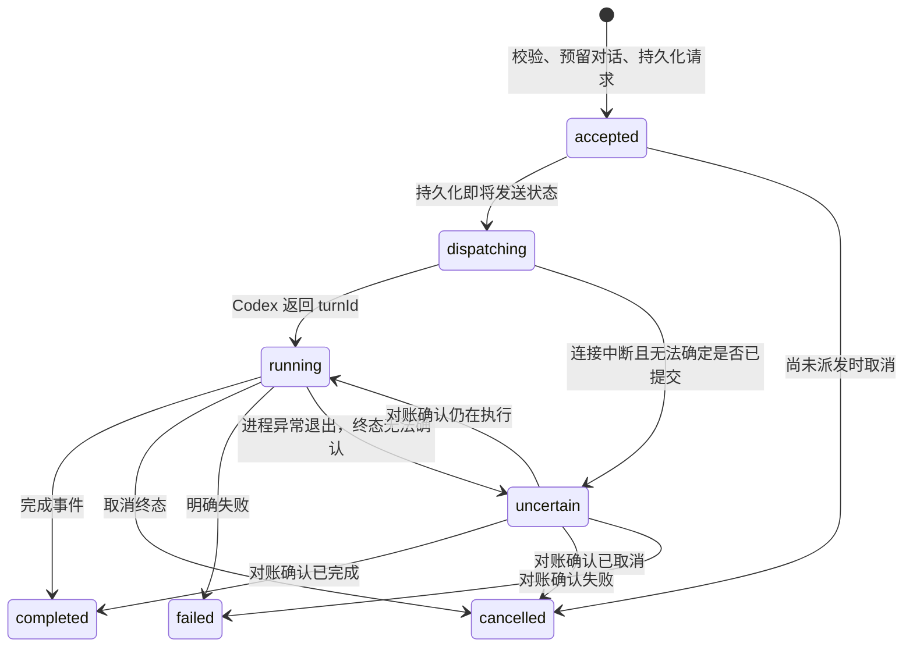

# Zotero Codex Reader：接口与状态约定

这是[开发计划](2026-09-08-zotero-codex-reader.md)的规范性附录，描述待实现的 v0.1 接口，不表示代码已经存在。数字上限属于首版工程选择，可依据测试调整并同步修改测试。

## 1. 模块边界

生产架构为 **Zotero 插件 → 原生子进程管道 → Codex app-server**。插件自有的应用逻辑在 Zotero 的 Gecko JavaScript 环境内执行；Node.js 24 仅用于开发、构建与测试，不随 XPI 分发，不作为用户运行依赖。

| 模块 | 位置 | 输入与输出 | 不承担的职责 |
| --- | --- | --- | --- |
| 公共契约 | `packages/contracts` | 选区、会话、设置、事件与运行时校验 | 平台 API、模型凭据 |
| Zotero 适配器 | `packages/zotero` | 阅读器事件/附件 → `Citation`、`PaperScope`、原文跳转 | Codex 协议与凭据维护 |
| 运行监督器 | `packages/zotero` | 随包组件清单、插件生命周期 → 就绪的 `ReaderClient` | 要求用户手动安装运行时或复制配对码 |
| 平台适配器 | `packages/zotero` | `Subprocess`/`IOUtils` → `ProcessPort`/`StoragePort` | 会话业务规则 |
| 侧栏控制器 | `packages/zotero` | 引用、问题、连接状态 → 草稿、发送/停止、对话显示 | 直接启动 Codex 或读取模型令牌 |
| 会话管理器 | `packages/core` | 业务调用、Codex 事件 → 持久化会话与请求状态 | DOM、Zotero 数据库、Node API |
| Codex 适配器 | `packages/core` | 会话指令、私有 stdio → 标准化文本增量、完成、错误 | Zotero 页码/引用解析、任意 RPC 转发 |

`packages/core` 为纯 TypeScript 业务层，以端口注入进程和存储能力；生产依赖不能引入 `node:*`、Node 原生扩展或必须依赖 Node 全局对象的库。不存在项目自建的 HTTP 服务、公开监听端口、配对流程或长轮询接口。Codex 官方登录流程可能使用自己的本机 OAuth 回调，此项不等于项目自建 HTTP API。

## 2. 公共类型

以下类型的实现位置为 `packages/contracts/src/index.ts`。运行时校验使用 `packages/contracts/src/validation.ts`，不能只依靠 TypeScript 类型。

```ts
export type UUID = string;
export type Rect = [number, number, number, number];

export interface GenerationSettings {
  model: string;
  serviceTier: string | null;
  effort: string | null;
}

export interface AccountStatus {
  state: "signedOut" | "signingIn" | "signedIn" | "expired";
  displayLabel?: string;
}

export interface LoginFlow {
  loginId: string;
  authorizationUrl: string;
}

export interface LoginStatus {
  loginId: string;
  state: "pending" | "succeeded" | "cancelled" | "failed";
  message?: string;
}

export interface PaperScope {
  clientId: UUID;        // Zotero profile 的持久随机 namespace；启停、升级不重建
  libraryId: number;     // Zotero 本地库标识；仅在本 clientId 内解释
  attachmentKey: string;
}

export interface Citation {
  id: UUID;
  paper: PaperScope;
  text: string;          // 保持原文；不以 HTML 形式传递
  title: string;
  authors: string[];
  year?: string;
  doi?: string;
  pageLabel: string;     // 面向读者的页码，可能为罗马数字
  positions: Array<{ pageIndex: number; rects: Rect[] }>;
  capturedAt: string;    // ISO 8601
  contextScope: "selection";
  sourceRevision?: { size: number; modifiedAt: string }; // 轻量变化检测，不是内容一致性证明
}

export interface Conversation {
  id: UUID;
  paper: PaperScope;
  title: string;
  settings: GenerationSettings; // 最近一次接受的请求设置，草稿可准备下一轮不同设置
  activeRequestId: UUID | null;
  messages: Message[];
  lastSeq: number;
  createdAt: string;
  updatedAt: string;
}

export interface Message {
  id: UUID;
  requestId: UUID;
  role: "user" | "assistant";
  phase: "commentary" | "final" | null; // user 为 null；保留回答阶段供 UI 和恢复使用
  settings: GenerationSettings; // 不可变的请求设置快照
  effectiveSettings?: GenerationSettings; // 仅有明确上游证据时填写，不由请求值冒充
  text: string;
  citations: Citation[];
  status: "pending" | "streaming" | "completed" | "cancelled" | "failed" | "uncertain";
}

export interface SendInput {
  requestId: UUID;
  conversationId: UUID;
  action: "explain" | "ask";
  question: string;
  citations: Citation[];
  settings: GenerationSettings;
}

export interface SendReceipt {
  requestId: UUID;
  state: "accepted" | "dispatching" | "running" | "completed" | "cancelled" | "failed" | "uncertain";
  replay: boolean;
}

export type ReaderEvent = {
  seq: number;
  conversationId: UUID;
  requestId: UUID;
  at: string;
} & (
  | { type: "accepted" }
  | { type: "delta"; messageId: UUID; text: string }
  | { type: "messageCompleted"; messageId: UUID; finalText: string; phase: "commentary" | "final" | null }
  | { type: "completed"; messageId: UUID; finalText: string }
  | { type: "cancelled"; messageId: UUID | null }
  | { type: "failed"; code: ErrorCode; message: string }
  | { type: "uncertain"; message: string }
);

export type ErrorCode =
  | "RUNTIME_UNAVAILABLE" | "INVALID_REQUEST" | "PAYLOAD_TOO_LARGE"
  | "VERSION_UNSUPPORTED" | "CODEX_NOT_FOUND" | "AUTH_REQUIRED"
  | "BUSY" | "REQUEST_CONFLICT" | "MODEL_UNAVAILABLE"
  | "RATE_LIMITED" | "CODEX_EXITED" | "HISTORY_UNAVAILABLE"
  | "CURSOR_EXPIRED" | "READER_POLICY_UNAVAILABLE" | "UNSUPPORTED_INTERACTION"
  | "NOT_FOUND" | "INTERNAL_ERROR";

export interface ReaderError {
  error: { code: ErrorCode; message: string; retryable: boolean };
}

// 内部日志重放辅助类型；不是 HTTP 或 UI 长轮询接口。
export interface EventBatch {
  events: ReaderEvent[];
  nextSeq: number;
}

export interface ModelOption {
  id: string; // 使用可发送给 turn/start.model 的上游 model 字段
  displayName: string;
  isDefault: boolean;
  supportedReasoningEfforts: Array<{ id: string; description: string }>;
  defaultReasoningEffort: string | null;
  serviceTiers: Array<{ id: string; name: string; description: string }>;
  defaultServiceTier: string | null;
}
```

`Citation.paper` 必须与目标会话完全一致。v0.1 不接受跨论文引用，一个附件可以有多个对话。模型、速度、推理强度都允许在同一会话中切换；从下一次发送生效，不改变 conversationId/threadId，不清除历史。

每个 SendInput 带完整 settings 并参与请求 hash。上游目录仅提供可选能力，最终账户可用性由实际请求决定。切模型时校验其余设置，明确展示新默认/待选择状态，不把不支持的组合静默变成另一种请求。生成中改控件仅修改草稿设置，本轮快照保持不变。

## 3. 输入约束

- 业务输入的 UTF-8 JSON 序列化结果最大 256 KiB；进程内调用也必须执行结构、字段和大小校验。Codex stdout 使用独立的有界消息缓冲，不能把请求上限误用于合法长回答。
- 每条引用 1–8,000 个 Unicode code point，每次最多 4 条引用；超过时明确提示重新选择，不静默截断。
- 问题最多 4,000 个 Unicode code point。`explain` 必须有引用；`ask` 必须有非空问题。追问允许引用数组为空。
- 标题最多 1,024 字符，作者最多 50 位且每项最多 256 字符；DOI、年份和页码按长度限制，不推断用户提供的字符串是可执行链接。
- 页面索引为非负整数；矩形必须由有限数值构成；首版要求 `positions.length === 1`。源事件出现 `nextPageRects` 或多个页面范围时直接提示“请缩小到一页”，不得先裁掉位置再通过验证。阅读器可能在事件前截取跨页内容，因此不声称能从一个已截断事件还原任意多页选区。
- 所有 ID、枚举、字段类型均由运行时校验器检查；额外未知字段拒绝。
- settings 的 model/effort/serviceTier 必须匹配当次目录允许的组合；未知档位返回 INVALID_REQUEST/MODEL_UNAVAILABLE，不能把速度映射成更低 effort。默认档位的 null/省略语义由固定版本适配器明确处理。
- 从模型回答解析出的内容不能变成插件指令、系统配置或新的后台工具请求。

## 4. 自动运行和账户登录

每个平台/架构的 XPI 包含插件 JS 和固定版本的 Codex 可执行文件，不包含 Node 运行时或 Node companion。RuntimeSupervisor 校验清单后提取到插件专用版本目录；提取成功并设置必要执行权限后，由 Zotero `Subprocess.call()` 直接启动 `codex app-server`，通过该子进程的私有 stdin/stdout 完成协议握手。原生 API 的存在已经源码核实，真实发行物的启动、流读取和系统安全检查仍需 T0 实测。

监督器为整个插件生命周期共享实例；侧栏和阅读窗口只取得进程内 `ReaderClient`，不取得原始管道、文件句柄或凭据。重复窗口复用同一监督器；并发启动采用 single-flight。关闭侧栏只移除视图订阅，继续接收并保存回答。禁用/卸载插件或退出 Zotero 时，监督器收尾并停止自己创建的 Codex 进程。

运行与账户状态放在插件专用目录，并验证不会继承用户其他 Codex 客户端的工具、插件、MCP、项目指令或账户配置。目录只由一个插件运行实例持有；互斥机制及崩溃后的锁恢复由 T0 验证。启动失败提供界面重试，有限次数自动恢复；不能终止其他程序的进程，也不能通过取消系统隔离属性代替正确封装、签名与发行验证。

正常设置不提供任意服务器 URL 或可执行文件路径；开发者调试入口与发行流程分开。插件不创建本地 HTTP 业务服务，因此不设计 Authorization header、配对 token、端口发现、CORS 或 HTTP 重连。Codex 自己的 OAuth 回调仍按官方协议处理。

用户点击“使用 ChatGPT 登录”后，核心层调用 `account/login/start(type=chatgpt)`，将 `loginId`/`authorizationUrl` 交给插件打开系统浏览器；收到完成通知后重新查询账户状态。插件不显示密码输入框、不接收密码、不复制 token。取消、失败、过期重登都保留草稿和旧历史；同一时刻只允许一个有效登录流程。

网页登录由官方流程完成，不让用户去终端执行 `codex login`。关闭侧栏/停止后台不等于 `account/logout`。登录完成、目录刷新和额度变化按上游实际响应更新 UI，不把拥有 ChatGPT 账户等同于拥有任意模型或服务档位。

## 5. 进程内业务契约

侧栏通过 `ReaderClient` 调用核心层，异步结果和 `subscribe(listener)` 事件驱动 UI。业务接口不包含原始模型令牌、Codex 配置、绝对 PDF 路径或任意上游线程枚举结果。

| 方法 | 输入 | 返回与语义 |
| --- | --- | --- |
| `status()` | 无 | API/插件/Codex 版本、账户与阅读策略就绪状态 |
| `models()` | 无 | `ModelOption[]`；从 Codex 查询，失败不伪造可用型号 |
| `account()` | 无 | `AccountStatus`，不包含令牌 |
| `startLogin()` | 无 | `LoginFlow`；并发点击复用当前有效流程 |
| `loginStatus(loginId)` | 流程 ID | `LoginStatus`，完成后重查 account |
| `cancelLogin(loginId)` | 流程 ID | `void`；取消幂等，不退出已登录账户 |
| `current(paper, title, settings?)` | 当前附件、标题和可选初始设置 | `Conversation`；查找或创建当前会话 |
| `newConversation(paper, title, settings?)` | 当前附件、标题和可选初始设置 | `Conversation`；显式新建会话 |
| `list(paper)` | 当前附件范围 | `Conversation[]`；只返回本插件管理的会话 |
| `get(conversationId)` | 会话 ID | 包含 `lastSeq` 的 `Conversation` 完整快照 |
| `send(input)` | `SendInput` | `SendReceipt`；相同请求重放返回 `replay: true`；复用 ID 但内容不同则 `REQUEST_CONFLICT`，会话已有活动请求则 `BUSY` |
| `request(conversationId, requestId)` | 会话与请求 ID | `SendReceipt`；用于发送结果不确定时查询；不存在时抛出 `NOT_FOUND` |
| `cancel(conversationId, requestId)` | 会话与请求 ID | `SendReceipt`；只表示已提出取消或当前终态，只有终态事件代表已取消 |
| `subscribe(listener)` | 事件监听器 | `Unsubscribe`；按事件中的 conversationId 路由，取消订阅不取消请求 |

同步和异步校验错误统一携带 `ReaderError.error` 中的代码、用户可读消息和可重试标记；不再映射 HTTP 状态码。额度错误用业务 `RATE_LIMITED` 保留语义；已接受请求的后续失败通过事件和持久化请求状态报告。

事件按对话独立递增，UI 按 seq 去重。核心层将文字增量以约 80 ms 为上限合并刷新，避免逐 token 写盘和重排 DOM。每个对话内只允许一个活跃请求，重复点击不排成多个付费请求。

视图挂载/重开时先订阅并暂存事件，再读取 `get()` 快照，最后仅应用 `seq > snapshot.lastSeq` 的事件，避免订阅与快照之间丢消息或重复显示。快照必须在核心层的会话串行化边界内生成，使消息和 `lastSeq` 对应同一状态。内部可用 `EventBatch` 做日志重放，但不向侧栏暴露 `waitMs` 或轮询传输。事件监听器失败不得影响持久化和其他视图；已取消订阅的视图不得继续更新 DOM。

## 6. 内部接口

实现时允许类名不同，但公共签名改变必须先同步本附录、调用方和契约测试。

```ts
export type Unsubscribe = () => void;

export interface ReaderStatus {
  apiVersion: 1;
  pluginVersion: string;
  codexVersion: string;
  auth: "ready" | "required";
  readerPolicy: "ready" | "blocked";
}

export interface ReaderClient {
  status(): Promise<ReaderStatus>;
  models(): Promise<ModelOption[]>;
  account(): Promise<AccountStatus>;
  startLogin(): Promise<LoginFlow>;
  loginStatus(loginId: string): Promise<LoginStatus>;
  cancelLogin(loginId: string): Promise<void>;
  current(paper: PaperScope, title: string, settings?: GenerationSettings): Promise<Conversation>;
  newConversation(paper: PaperScope, title: string, settings?: GenerationSettings): Promise<Conversation>;
  list(paper: PaperScope): Promise<Conversation[]>;
  get(conversationId: UUID): Promise<Conversation>;
  send(input: SendInput): Promise<SendReceipt>;
  request(conversationId: UUID, requestId: UUID): Promise<SendReceipt>;
  cancel(conversationId: UUID, requestId: UUID): Promise<SendReceipt>;
  subscribe(listener: (event: ReaderEvent) => void): Unsubscribe;
}

interface RuntimeSupervisor {
  ensureStarted(): Promise<ReaderClient>;
  stop(): Promise<void>;
}
```

`ensureStarted()` 对并发调用采用 single-flight；只有固定可执行文件校验、提取、Codex `initialize`/`initialized` 握手、存储初始化和阅读策略检查成功后返回同一核心客户端。未登录时返回可执行登录流程的客户端，发送操作仍受 `AUTH_REQUIRED` 限制。`stop()` 不作用于用户其他 Codex 进程。原始进程管道与 Codex 适配器只在监督器和核心层内部流转，不向 UI 返回 endpoint/token。

### 原生进程和存储端口

以下是项目自己的最小能力边界，不是假定 Gecko 提供同名接口。`packages/zotero` 实现适配器，`packages/core` 使用这些端口；测试使用内存或可控假实现。

```ts
export interface ProcessSpec {
  executable: string; // 监督器校验后的固定路径，不接受模型/论文提供的路径
  args: readonly string[];
  cwd: string;
  env: Readonly<Record<string, string>>; // 显式允许的环境，不无条件继承用户工具配置
}

export interface ManagedProcess {
  stdout: AsyncIterable<string>; // 增量 UTF-8 解码后的片段，不假定每片段就是一条 JSON
  writeStdin(chunk: string): Promise<void>;
  wait(): Promise<{ exitCode: number | null }>;
  terminate(): Promise<void>; // 只处理该句柄对应的自有进程
}

export interface ProcessPort {
  spawn(spec: ProcessSpec): Promise<ManagedProcess>;
}

export interface StoragePort {
  read(relativePath: string): Promise<Uint8Array | null>;
  writeAtomic(relativePath: string, bytes: Uint8Array): Promise<void>;
  append(relativePath: string, bytes: Uint8Array): Promise<void>;
}

export interface ConversationRepository {
  current(paper: PaperScope): Promise<Conversation | null>;
  create(paper: PaperScope, title: string, settings: GenerationSettings): Promise<Conversation>;
  list(paper: PaperScope): Promise<Conversation[]>;
  get(id: UUID): Promise<Conversation>;
  save(value: Conversation): Promise<void>;
}
```

进程适配器将原生输入流包装为增量文本流，必须处理 UTF-8 字符和 JSON 行跨片段、同一片段含多条消息、有界缓冲、EOF 与写入背压。原生 `InputPipe.readString(..., {stream: true})` 的实际行为以固定 Zotero 版本测试为准；不能假定一次 read 返回完整协议消息。stderr 由适配器持续排空并丢弃，防止子进程阻塞；默认不记录、不混入协议 stdout、不向核心层/UI 传递原始内容。

`StoragePort` 的所有路径相对于监督器指定的插件私有数据根目录，拒绝绝对路径和目录穿越。`writeAtomic`/`append` 完成回执必须满足经 T0 验证的恢复语义，核心层才可以承诺 accepted/dispatching 已持久化；接口名称本身不证明原生 API 有刷新或原子性保证。基线先验证进程崩溃/强制退出后的恢复，掉电与文件系统损坏不在首版已证明保证之内。若原生追加方案无法满足顺序和恢复要求，T0 可选择原子替换日志分段等实现，并同步适配器与契约测试；验证前不得把状态写入成功当作可以安全派发的依据。

核心层的 ReaderService 实现 `ReaderClient`，以 `ConversationRepository`、请求/事件日志和 `CodexClient` 协作；这些均位于 `packages/core`。不能因为处于同一进程就省略输入校验、请求日志、状态机或 uncertain 对账。

```ts
export interface Draft {
  settings: GenerationSettings | null; // 尚未登录/加载目录时允许未选择，发送前必须解析
  paper: PaperScope;
  question: string;
  citations: Citation[];
}
```

UI 持久化未提交草稿使用以下类型化接口，不直接取得 StoragePort。实际文件为 `packages/zotero/src/storage/local-state.ts`；请求是否已发送仍仅由 ReaderClient/M3 决定。

```ts
export interface DraftStore {
  read(paper: PaperScope): Promise<Draft | null>;
  write(draft: Draft): Promise<void>;
}
```

纯函数 `paperId(paper: PaperScope): string` 使用 `JSON.stringify([clientId, libraryId, attachmentKey])`，不靠标题或字符串拼接的歧义判断论文身份。`validateSendInput(value: unknown): SendInput` 返回已检查对象或抛出携带 `INVALID_REQUEST` 的错误。

`addCitation(draft: Draft, citation: Citation): Draft` 返回新草稿，不调用网络；同一 citation ID 重复加入只保留一份。`makeExplain(citation: Citation, conversationId: UUID, requestId: UUID, settings: GenerationSettings): SendInput` 创建带默认解释问题的请求；`renderAnswer(doc: Document, markdown: string): DocumentFragment` 创建净化后的展示片段。

`openCitation(citation: Citation): Promise<void>` 先检查当前 profile 的 clientId，再按 `(libraryId, attachmentKey)` 解析当前 item ID。不同 profile 的引用显示“属于另一阅读环境”，不猜测匹配。若 file size/mtime 已变化，保留原引文并提示定位可能过期，经用户点击“仍打开该页”才使用旧页信息；这些轻量字段不能保证识别所有文件变化。

`captureSelection(event: unknown, clientId: UUID): Promise<Citation>` 只在适配器内部使用 Zotero 私有字段。确切 SDK 类型以本机版本核查结果补充到适配层，不能向业务层泄漏。备份/恢复包含 profile namespace 和核心层状态，不能只复制其中一端后以新 clientId 自动重建重复历史。

### Codex 0.144.1 适配器约定

这些字段由本机 CLI 生成的 schema 核实；实施时只保留所用类型及版本指纹，不把整个上游协议暴露到侧栏业务接口。

| 动作 | 固定版本的方法与注意事项 |
| --- | --- |
| 握手 | `initialize` 的 clientInfo；等待成功后发送 `initialized` |
| 会话 | `thread/start` / `thread/resume`，thread 级 sandbox 为 `"read-only"` |
| 提问 | `turn/start`，input 使用 `{type:"text",text,text_elements:[]}`；关联 clientUserMessageId |
| 轮次策略 | `sandboxPolicy:{type:"readOnly",networkAccess:false}`，与 thread 字段的拼写不同 |
| 停止 | `turn/interrupt:{threadId,turnId}`；返回不等于已经取消 |
| 对账 | `thread/read:{threadId,includeTurns:true}`，按 userMessage.clientId 与 turn 终态核对 |
| 模型 | `model/list` 翻页到 nextCursor 为空；目录结果不保证账户额度 |

模型目录的 `model` 映射为 ModelOption.id，`supportedReasoningEfforts[].reasoningEffort` 映射为选项 id，serviceTiers 保留真实 id/name/description。`additionalSpeedTiers` 是旧字段，优先使用 serviceTiers；不能硬编码 Fast 或推理等级在所有模型上都存在。

每次 turn/start 显式传递已校验的 settings.model、settings.serviceTier、settings.effort；变更沿用原 threadId。serviceTier 从自定义档位切回默认时必须测试显式 null 的清除语义，不能因省略字段沿用上轮档位；effort 优先解析为该模型具体默认值。无对应能力的模型使用已验证的空值/省略语义。参数变更不触发 thread/start、fork 或清空上下文。

创建和恢复都重新应用阅读配置，并检查生效的 cwd、sandbox、approvalPolicy 和 instructionSources；不能仅复用 threadId 就假定配置安全。事件按 `(threadId,turnId,itemId)` 聚合；`item/completed` 的完整回答校正增量，`turn/completed` 确定终态。`error.willRetry: true` 表示上游仍在尝试，不能立刻把它标成最终失败。保留 agentMessage 的 commentary/final 区别，不将多个 item 无分隔地重复拼接，也不把 reasoning 展示为回答。

CodexClient 的异步方法返回约定：`initialize(): Promise<void>`；`account(): Promise<AccountStatus>`；`startLogin(): Promise<LoginFlow>`；`loginStatus(loginId:string): Promise<LoginStatus>`；`cancelLogin(loginId:string): Promise<void>`；`models(): Promise<ModelOption[]>`；`startThread(settings:GenerationSettings): Promise<{threadId:string}>`；`resumeThread(threadId:string): Promise<void>`；`startTurn(threadId:string,input:SendInput): Promise<{turnId:string}>`；`interrupt(threadId:string,turnId:string): Promise<void>`；`readThread(threadId:string): Promise<CodexHistory>`；`close(): Promise<void>`。`subscribe(listener)` 返回取消订阅函数，listener 消费适配层的 CodexNotice。

```ts
export interface CodexHistory {
  turns: Array<{
    id: string;
    status: "inProgress" | "completed" | "interrupted" | "failed";
    clientUserMessageIds: string[];
    agentMessages: Array<{ itemId: string; text: string; phase: string | null }>;
  }>;
}

export type CodexNotice = {
  threadId: string; turnId: string;
} & (
  | { type: "text"; itemId: string; delta: string }
  | { type: "messageCompleted"; itemId: string; text: string; phase: string | null }
  | { type: "turnCompleted"; status: "completed" | "interrupted" | "failed" }
  | { type: "error"; code: string; message: string; willRetry: boolean }
);
```

CodexHistory/CodexNotice 属于 `packages/core/src/codex/`，不进入侧栏公共契约。上游多条 agentMessage 对应多个 Message，seq 在核心层统一分配；ReaderEvent.messageCompleted 只结束一个消息块，不释放会话 busy 状态，并把 phase 保存到 Message。上游阶段为空或未知时保存 null，不推断为 final。ReaderEvent.completed 在 turn 正常结束时仅发一次，指向最后的回答消息；其中 finalText 替换对应 message 的增量缓存，不再次追加相同全文。completed 却无回答时发送明确失败；正常 interrupted 即使没有回答仍发送 cancelled，messageId 为 null，不能虚构消息。

## 7. 请求、崩溃与恢复



- `requestId` 在第一次点击发送时生成，查询和重试复用；内容变化生成新 ID。
- 幂等键按 `(conversationId, requestId)` 保存，并记录规范化业务 JSON 的 SHA-256。不能把重复进程内调用或 UI 恢复变成新的 Codex turn。
- 先原子保存 accepted，再返回接收结果；写入 Codex stdin 前持久保存 dispatching。记录 `turnId` 后才进入 running。
- `clientUserMessageId` 若受固定版本支持，可以辅助核对；它本身不提供业务层 exactly-once 保证。
- 崩溃恰好发生在“已向 Codex 提交、尚未记下回执”时，单靠本地文件无法证明是否执行。显示 uncertain，读取上游历史核对。确认 running 则恢复订阅，确认终态则释放该会话的 activeRequestId。
- 仍无法对账的旧 thread 保持隔离，禁止在同一 conversation 上发新问题；允许用户明确选择“新建对话并重新发送”，创建新的 conversationId/requestId，并说明旧请求可能仍在执行、此举会新增请求。旧 uncertain 历史保留，不用超时或 UI 关闭冒充已结束。
- 重启发现只有持久化 accepted、没有 dispatching/cancelled 记录时，可以继续派发原请求一次；只有这一状态能证明尚未写入上游。视图重新订阅和 Codex 进程重连本身不触发派发。
- 进程内异步调用中断或视图丢失回执时先查询 requestId；只有确定不存在且核心层及存储健康时，才以原 ID 重新发送。遇到 uncertain 不自动重试。
- 视图恢复用快照和 seq 去重，Codex 进程重连先对账，不因为重连执行 `turn/start`。关闭侧栏/切换 PDF 仅停止对应 UI 订阅，插件全局核心层继续保存回答；点击停止才取消该轮。禁用插件或退出 Zotero 时监督器对自有活动请求收尾并停止自有后台进程，确认不了终态则记录 uncertain，重开后对账。
- 取消与完成同时到达时，以已经确认的 Codex 终态为准；迟到的取消回执不能覆盖 completed。

## 8. 持久化和数据生命周期

核心层通过 `StoragePort` 维护插件专用状态目录：配置、会话快照、请求日志和事件日志分开。macOS 默认路径为系统 Application Support 下的项目专用目录，由平台路径函数生成，仓库不含个人绝对路径；最终目录名随项目定名固定。Codex 另使用该项目管理的独立运行/账户目录。生产链路没有项目自建的连接 token。未来支持其他系统前分别验证执行权限与目录访问限制。

每个会话文件带 `schemaVersion: 1`。快照由平台存储适配器执行同目录临时文件和原子替换；活动状态转换采用有序日志写入，完成语义和必要刷新操作必须经 T0 证明，不能直接把 Node 的 fsync/rename 保证搬到 Gecko。不可解析文件保留原始副本并报告，不静默覆盖；坏尾日志如何识别、截取和恢复必须有故障测试。快照保存最后应用事件 seq，重放时去重。尚未持久化的显示增量可在异常终止后丢失，并通过上游完整消息校正；是否可确认请求已提交始终由持久化状态及上游对账决定，不以缺少显示增量触发重新发送。

请求/事件日志属于包含论文和对话正文的**私有持久化数据**，永不自动进入诊断附件。可分享诊断只允许版本、错误代码、请求数量和状态等白名单字段；不能靠替换 token 的正则就认定正文日志已脱敏。默认不保存原始 stdio/stderr；本机 doctor 可显示真实状态目录，可分享版本则使用无用户名的通用路径描述。

首次版本不自动清除历史。提供查看存储位置和显式清除插件本地记录的说明；说明 Codex 另有自己的会话记录，清除插件缓存不等于删除 Codex 或云端数据。不承诺跨设备同步。

## 9. 阅读请求模板

引用与用户问题作为结构化 JSON 文本附在固定阅读指令后，使用 JSON 序列化避免分隔符被原文破坏。首版传递 `contextScope: "selection"`，不声称已提供全文。

默认“详细解释”的问题：

> 请用中文解释这些选区。先说明这段话的含义，再解释关键术语、符号或推理步骤。保留原文记号；区分作者陈述与补充解释。如果缺少定义或前后文，请指出具体缺少什么，不补造论文内容。

论文内容属于被分析的数据；其中即使出现要求运行程序、读取凭据或改变规则的文本，也不改变应用权限。这一模板改善回答行为，但权限保证必须来自实际工具配置和运行时策略，不能靠提示词代替。

## 10. 阅读器布局与工具栏

这些接口属于 `packages/zotero/src/reader/`，描述项目自己的适配层，不是假定 Zotero 已提供同名 API；不进入核心业务契约。

```ts
interface ReaderLayoutController {
  show(origin: "toolbar" | "selection" | "history"): Promise<void>;
  hide(): Promise<void>;
  toggle(): Promise<void>;
  setWidth(cssPixels: number): Promise<void>;
  dispose(): void;
}

interface ReadingAnchor {
  pageIndex: number;
  pdfX: number;
  pdfY: number;
  viewportYFraction: number;
}

type ReaderScale =
  | { mode: "auto" | "page-fit" | "page-width" }
  | { mode: "custom"; value: number };

interface TemporaryLayoutState {
  originalScale: ReaderScale;
  ownsTemporaryScale: boolean;
  previousPane: { collapsed: boolean; selectedSection: string | null };
  ownsPaneRestore: boolean;
}
```

### 入口与可见状态

- 本机 9.0.6 的 toolbar 顺序是自定义 Toolbar 区、搜索、原生右栏按钮；用 `renderToolbar` 同步 append 即可取得目标位置。该事件没有专门 before/after 参数，不能编造定位 API。
- 宿主每次渲染会清理自定义区域；绑定当前节点并复用单一业务监听，不从异步返回追加到旧容器。可见状态和按钮 pressed/expanded 属性由同一控制器维护。
- Toolbar.toggle 只改变 UI。两种选区入口调用 show，已显示时保持显示；不能复用 toggle 导致选中文本后侧栏反而关闭。
- native `reader.setContextPaneOpen()` 只同步阅读器内部状态；必须真正改变宿主 context pane/分隔条布局并选择聊天 section。内部 API 统一封装，具体版本由 T0 验证。
- `registerSection` 只证明能添加内容区域，不自动保证独立全高聊天窗口。聊天记录滚动、底部输入区、原生 section 切换和实际布局必须一起验证。

### 选区上方操作条与原生标注共存

More details / Ask in sidechat 在选区上方的独立紧凑操作条中呈现。正常情况下原生颜色/高亮/下划线面板位于下方，所有原生行为保持。用户清除选区或改选时，旧操作条撤销；点击任一插件项前保存不可变 citation 与选区版本，展开侧栏导致 blur/resize 也不能换成错误引用。

已核查的 renderTextSelectionPopup 回调只暴露 annotation；append 会把按钮加入原生面板内部、现有颜色和划线选项之后，不提供上方独立定位所需的 rect。T0 必须验证从内部 reader 的选择几何取得视口矩形的版本适配器，不能编造公开 params.rect 或简单移动整个原生 popup。

`selection-actions.ts` 负责几何转换和生命周期。PDF 位置先经阅读器 viewport 转换为 CSS 矩形，再转换到操作条所在文档坐标系，处理 iframe 偏移；不能把 PDF points、设备像素和 CSS px 混用。优先放在选区上方，随后选择与原生面板、选区不重叠且可见的侧方/下方位置。原生面板在视口边缘可能自行翻到上方，插件须重新避让，不覆盖它。

操作条只在自身按钮范围接收指针事件，不用整块透明蒙层拦截阅读器。滚动/缩放期间收起，稳定后仅在选区仍有效时重新定位；旧异步回调通过选区版本检查丢弃。原生标注动作不产生模型请求，插件动作不创建多余高亮/下划线。对应验收 A29–A30。

### 宽度、阅读锚点与缩放所有权

首次建议宽度 360 CSS px，优先保留用户之前的分隔条宽度。初始限幅策略为：最大宽度 `min(560, availableWidth * 0.45)`，最小宽度 `min(320, 最大宽度)`；可用宽度先扣除宿主已占用的区域与分隔条。数字是待实测的设计默认值，保证窄窗仍给 PDF 留出空间；控件在窄栏换行，不覆盖正文。窗口临时变窄只限幅，不覆盖用户保存的期望宽度。

每次布局变化的顺序：捕获**当前** PDF 坐标锚点 → 改变真实停靠宽度 → 原生重新计算缩放/视口 → 恢复当前锚点与附近屏幕位置。关闭时使用关闭前正在阅读的位置，不能重新读取打开时保存的旧页；PDF 到页边界无法维持相同屏幕位置时，以正确页/段落仍可见为准。

- 原生 auto/page-fit/page-width 随 resize 重新计算，保留原模式。
- 用户原先固定数值缩放：show 时保存它，设置临时 page-width 并标记 ownsTemporaryScale。
- 插件通过受保护的内部调用缩放，不将自己的调用误识别为用户缩放；用户主动 zoom 后清除此标记。
- hide 仅在仍拥有临时缩放时恢复 originalScale；用户期间新选择优先。
- 同一 PDF 阅读 view 保存独立布局状态；切到别的 PDF 不带入旧锚点或缩放所有权。
- resize 只响应实际阅读容器尺寸变化，合并拖动期间事件并防重入；响应文本 token 不改变 PDF 容器尺寸，不触发此流程。
- 不用 CSS transform 拉伸 PDF，不保存裸 scrollTop 冒充阅读位置；必须验证文字选择和标注坐标仍一致。

进入聊天前保存原生右栏状态，用户期间主动选择别的原生区块时清除 ownsPaneRestore。hide 只恢复仍属于本次聊天切换的状态；禁止把用户新打开的信息/笔记页关掉。

### 视觉和宿主范围

优先复用宿主 toolbar-button 和主题变量，例如本机源码中的 `--material-toolbar`、`--material-panedivider`、`--fill-secondary`，读取与宿主主题对应的字体/间距。按钮当前具体尺寸属于版本实现，不能固化成跨版本假设。默认使用单色图标、轻边框、原生焦点与 hover；侧栏保持同样的字体层级、输入框、菜单和滚动样式。

截图里的主窗口标准右侧布局是首轮验证基线。Zotero 堆叠布局可能把 context pane 放到底部，独立阅读窗口也没有相同路径：必须分别验证适配，不静默改用户全局布局，不在未测试时宣称同样支持。全高聊天和 native section 共存是 G1 的验证项，不能从 API 存在直接推出成功。

依据：[Zotero 阅读器事件 API](https://www.zotero.org/support/dev/zotero_7_for_developers#custom_reader_event_handlers)；本机 9.0.6 安装包中的 reader.js、reader.css、contextPane.js、itemPaneSidenav.js 和 PDF viewer.mjs 源码。当前为源码核查和产品规则，尚未进行真实 UI 验收。
