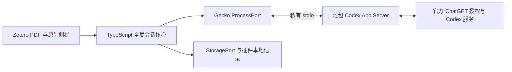

# Zotero Codex Reader Implementation Plan

> **For agentic workers:** REQUIRED SUB-SKILL: Use superpowers:subagent-driven-development (recommended) or superpowers:executing-plans to implement this plan task-by-task. Steps use checkbox (`- [ ]`) syntax for tracking.

**Goal:** 用户从 GitHub 下载一个 Zotero 插件即可安装，在侧栏通过官方流程登录 ChatGPT，选区解释和连续对话，并像 Codex 一样选择模型、速度与推理强度。

**Architecture:** Zotero 原生插件通过 Gecko Subprocess 的私有 stdio 直接管理随包 Codex App Server。纯 TypeScript 核心负责会话、协议和恢复，ProcessPort/StoragePort 隔离原生进程与文件 API；Node 只用于构建和测试，不随产品发布中转服务。

**Tech Stack:** macOS arm64、Cursor + 官方 Codex IDE 扩展、TypeScript、npm workspaces、开发用 Node.js 24、esbuild、Zotero bootstrap/Gecko Subprocess/IOUtils、原生 DOM/CSS、markdown-it、DOMPurify、KaTeX、Vitest、GitHub Actions。具体依赖版本在 T1 核实后写入 lockfile；不使用浮动依赖构建发行包。

**Spec:** 执行顺序以[分阶段实施计划](2026-09-08-zcr-implementation-stages.md)为准；[模块设计](../../module-design.md)定义职责；[项目决策](../../project-decisions.md)固定名称/技术路线，[macOS 开发流程](../../development.md)固定 Cursor + Codex 工作方式；[用户流程](../../zotero-codex-user-flow.md)是产品验收依据；[现有设计](../../zotero-codex-design.md)、[接口与状态约定](2026-09-08-zotero-codex-reader-contracts.md)、[验收与发布矩阵](2026-09-08-zotero-codex-reader-acceptance.md)共同定义实施范围。

## Global Constraints

- “回答与后续对话显示在 Zotero 内部的侧边栏。”
- “这个动作本身不启动模型请求。”——指 Ask in sidechat，替代先前的 Add to side chat 标签。
- 开发工作台为 macOS 上的 Cursor + 官方 Codex IDE 扩展，日常流程见 docs/development.md。
- 首版正常用户流程不包含安装 Node/Codex CLI、启动终端服务或复制配对码；插件通过原生 stdio 直连自带 Codex。
- 底部提供模型、速度、推理强度选择；允许在同一对话中切换，下一条请求生效。
- 阅读器搜索按钮左侧提供原生样式的 Codex 侧栏开关；侧栏与 Zotero 视觉一致，并参与真实布局。
- 开关/拖宽侧栏和调整窗口时，PDF 自动适配可用区域并保持当前阅读位置；用户主动修改缩放具有优先权。
- “对话默认按 PDF 附件保存。”
- “页码标签与页面索引分别保存。”
- “插件不需要自行读取、复制或维护账户令牌。”
- “阅读会话默认采用只读权限。”
- “首版对话由插件管理，不承诺与 Codex 桌面应用现有任务或 side chat 自动同步。”
- 当前读取到的开发环境基线为 Zotero **9.0.6**、Codex CLI **0.144.1**、Node **24.11.0**。这是开发基线，不是已完成兼容性测试。
- 本次只形成开发计划；所有任务初始状态为未执行，未创建 GitHub 仓库、未安装插件、未开始模型请求。

---

## 1. 产品范围与首版决策

正式项目名为 **Zotero Codex Reader**，简称 **ZCR**，GitHub 仓库名固定为 `zotero-codex-reader`。尚未创建远程仓库，不声称名称独占。技术决策以直接 Gecko → Codex stdio 为准，早期 Node companion/HTTP 方案已移除。

### v0.1 必须完成

1. PDF 选区上方的独立操作条提供 More details 和 Ask in sidechat，均自动展开侧栏；下方原生颜色/高亮/下划线面板保持可用。
   同时在右上角搜索按钮左侧提供可随时开关侧栏的工具栏按钮，无选区/未登录时也可打开。
2. Zotero 主窗口 PDF 标签页右侧聊天区域，可自动展开、连续追问、停止生成。
3. 引用卡显示原文、论文标题和页码，可移除、返回原文。
4. 每个附件独立的草稿与会话；新建对话、查看该附件已有对话。
5. 中英文界面、Markdown 和基本 LaTeX 公式显示、浅色和深色主题。
6. 后台自动准备和启动、插件内 ChatGPT 登录入口、模型/速度/推理控制及断线恢复。
7. 单个完整的平台 XPI、安装文档、兼容性说明、可重复构建和 GitHub CI。
8. 原生风格的右侧停靠布局、可拖动宽度、PDF 自动适配与阅读锚点保持，兼容原有搜索/侧栏功能。

### 首版主动限制

| 维度 | v0.1 决策 | 原因与后续路径 |
| --- | --- | --- |
| 平台 | 开发和首发验证 macOS Apple Silicon；Intel Mac 实测后加入，Windows/Linux 后续 | 当前机器为 arm64；Node 测试通过不等于真实宿主支持 |
| Zotero | 开发和首轮验收 9.0.6；manifest 首版最小 9.0.6、最大 9.0.* | 不用 7 起源的 API 文档冒充 7/8 的运行测试 |
| PDF 窗口 | 首版支持主窗口 PDF 标签页 | 独立阅读器窗口列为 v0.2 验证任务；发现该模式时明确提示支持范围 |
| 原生布局 | 当前截图的标准主窗口右侧布局为首轮基线 | 堆叠模式另行验证；不自动修改 Zotero 全局布局来伪装支持 |
| 选区 | 首版只接受单页文字选区，并显示实际引用原文 | 已核查阅读器跨页选区有截断边界；出现跨页位置时提示缩小选区 |
| 上下文 | 选区 + 出处 + 当前对话历史 | 附近段落、整页、全文需要单独验证提取质量 |
| 登录 | 插件发起官方 ChatGPT 浏览器授权，使用插件专用后台状态 | Codex 管理令牌；独立状态与登录生命周期在 T0/T5 验证，不影响其他客户端 |
| 安装 | 每个受支持平台/架构提供一个含运行组件的 XPI，插件自动启动 | 原生提取、签名/隔离属性和重启必须通过 T0/T11；系统 Node/CLI 不是用户前提 |
| 聊天设置 | 模型、速度 service tier、推理 effort 三个独立控件，同会话下一轮生效 | 动态读取能力，发送时冻结设置，不静默切换 |
| 存储 | 本机持久化，不做 Zotero Sync 或跨设备同步 | 先证明附件归属和恢复正确 |
| 阅读权限 | 限制为阅读会话，关闭不需要的执行和外部集成能力 | 实际生效策略必须核查，不能把提示词当权限控制 |
| 分发 | GitHub Releases；首版不依赖 npm 发布或 Codex 插件市场 | 用户下载发行物即可安装；不扩大分发维护范围 |

不纳入 v0.1：整库 RAG、OCR、截图/图表理解、自动写回笔记、跨论文聊天、桌面 Codex 对话同步、遥测、后台静默上传、修改系统安装的 Codex。随插件升级其自带运行组件属于首版职责。

## 2. 成功标准

功能成功：用户在真实 PDF 选中一段文字，点击详细解释，侧栏显示同一段引用和逐步生成的回答；继续问“这里的第二步为什么成立”能延续对话；切到另一 PDF 不串话。

发布成功：另一测试者在没有系统 Node/Codex CLI 的干净环境安装一个 XPI，点击侧栏“使用 ChatGPT 登录”，随后独立完成选区解释、连续追问和三个设置控制；升级后保留会话。

质量成功：公开发行物不包含真实文献库、聊天内容、账户凭据或用户配置；UI 明确区分未发送引用、已发送问题、生成中和无法确认提交状态。

不以“脚手架能编译”“模拟后端通过”或“在浏览器能显示聊天界面”代替这些验收。

## 3. 架构、信任边界与数据流



### 为什么这样拆分

- Zotero 自带 JavaScript 环境、特权进程管道和异步文件 API，可以直接运行会话核心。
- ProcessPort/StoragePort 保留测试与宿主隔离，不需要额外 Node 进程或自建 HTTP API。
- 全局核心服务在插件生命周期内持有 Codex 与记录；关闭侧栏只销毁视图订阅，回答仍保存。
- XPI 自带固定 Codex 运行组件；插件校验、提取、启动并收尾，用户只安装和官方登录。
- 渲染层只得到受限 ReaderClient，不接收原始进程/文件句柄；不可信原文不改变执行策略。
- Codex 官方授权可能使用自己的本机回调；这不构成本项目的数据通信服务。

### 状态所有权

| 状态 | 唯一主要负责人 |
| --- | --- |
| 当前阅读附件、跳转坐标 | Zotero 适配器 |
| 未发送的草稿、所选引用、侧栏滚动状态 | 插件，按附件持久保存 |
| 模型/速度/推理选择 | 插件草稿；发送时复制为不可变请求设置 |
| Codex 组件版本、子进程与原生适配器 | 插件运行监督器 |
| conversationId → Codex threadId 映射 | 核心服务 |
| 已提交消息、请求状态、事件游标 | 核心服务 |
| Codex 上游会话和账户登录 | Codex 本身 |

用户从问题框发送成功后只清空该次提交的草稿，并保留消息中的引用；More details 单独解释点击的选区，不清掉其他未发送草稿。发送结果不明时先查 requestId，不能清空草稿后重新生成一个请求。

### 需要前置验证的四件事

| 编号 | 实验问题 | 通过条件 | 失败后的具体动作 |
| --- | --- | --- | --- |
| G1 | 搜索旁工具栏按钮和选区操作能否唤起真实停靠侧栏并自适应 PDF？ | 位置准确、布局真实变化、原生缩放重算、当前页/阅读段落保持、搜索/原生右栏正常 | 在 reader 适配层修复；不能以浮层、CSS transform 或回到旧页代替验收 |
| G2 | 固定版本能否支持独立登录、阅读范围和聊天设置？ | 浏览器授权、阅读策略、同会话下一轮的模型/速度/effort 均正确 | 修复认证与参数映射，不能用 CLI 登录或另开对话冒充目标流程 |
| G3 | 插件能否直接管理 Codex stdio 和可靠本地状态？ | 无系统 Node/CLI，原生进程、UTF-8/JSONL、EOF、取消、持久化恢复均通过 | 修复 Process/Storage 适配层，不增加用户手动操作或未声明的中转架构 |
| G4 | 完整平台 XPI 能否在干净环境安装？ | 真实下载文件安装，平台安全检查通过，插件内授权和提问 | 修复打包、签名与回退；源码启动不代替单包验收 |

## 4. 仓库结构与模块职责

```text
zotero-codex-reader/
  AGENTS.md                         # Cursor/Codex 共用的工程约定
  package.json                      # private npm workspaces、开发脚本
  package-lock.json
  tsconfig.base.json
  vitest.config.ts
  .nvmrc                            # 开发用 Node 24
  packages/
    contracts/src/
      index.ts                      # 业务 DTO、ReaderClient、端口类型
      validation.ts
      prompt.ts
    core/src/
      codex/client.ts               # JSONL/请求相关/原始事件适配
      codex/reader-policy.ts
      codex/account.ts
      codex/events.ts
      sessions/service.ts           # 实现 ReaderClient，全局生命周期
      sessions/repository.ts
      sessions/request-journal.ts
      sessions/event-log.ts
    zotero/
      manifest.json
      bootstrap.js
      prefs.js
      src/
        index.ts
        reader/selection.ts
        reader/selection-actions.ts # 选区上方操作条
        reader/reader-pane.ts
        reader/toolbar.ts           # 搜索左侧开关
        reader/layout.ts            # 原生停靠、自适应与锚点
        chat/draft.ts
        chat/controller.ts
        chat/view.ts
        chat/render-answer.ts
        chat/generation-settings.ts
        account/controller.ts
        runtime/supervisor.ts       # 返回同一 ReaderClient
        runtime/process.ts          # Gecko Subprocess 实现 ProcessPort
        runtime/storage.ts          # IOUtils 等实现 StoragePort
        runtime/paths.ts
        storage/local-state.ts
        preferences.ts
      runtime/manifest.json         # 固定 Codex 资产、平台/架构、hash
      assets/sidebar.css
      assets/icon.svg
      locale/en-US/reader.ftl
      locale/zh-CN/reader.ftl
  scripts/
    build.mjs
    dev.mjs
    package.mjs
    verify-artifacts.mjs
    bundle-runtimes.mjs
    release-manifest.mjs
    make-fixture-pdf.mjs
  tests/
    contracts/
    core/
    zotero/
    integration/
    live/
    fixtures/                       # 合成材料与 Node 专用测试替身
  docs/
    project-decisions.md
    development.md
    zotero-codex-user-flow.md
    installation.md
    troubleshooting.md
    compatibility.md
    privacy.md
    release.md
    spikes/
    qa/
    superpowers/plans/
  .github/workflows/ci.yml
  .github/workflows/release.yml
  .github/ISSUE_TEMPLATE/
  README.md
  README.zh-CN.md
  CONTRIBUTING.md
  SECURITY.md
  CHANGELOG.md
  LICENSE
  THIRD_PARTY_NOTICES.md
```

该树为目标结构，当前只有规划文档。Node 仅用于构建和测试，生产 bundle 不含 node:* 或 Node 全局依赖，不打包 Node runtime；Codex 原生资产仅进入发行构建，不提交大二进制到源码主分支。全局 core 的进程和存储操作经端口实现，侧栏 DOM 不直接拥有它们。

## 5. 执行顺序与里程碑

本文件保留 T0–T12 的实现细则和测试参考；实际顺序改为[分阶段实施计划](2026-09-08-zcr-implementation-stages.md)中的 S0–S7。T0 作为跨阶段技术验证集合，不要求在仓库初始化前完成整套产品验证。

| 阶段 | 实施范围 | 对应细则 | 交付成果 |
| --- | --- | --- | --- |
| S0 | Git、AGENTS、工程配置和最小编译入口 | T1 工程部分 | 正确项目根目录、功能分支、可构建工程 |
| S1 | Zotero 外壳、搜索旁开关与基础真实布局 | T2/T4 部分 + T0 宿主验证 | 开发 XPI 可加载，侧栏可开关，PDF 基础适配 |
| S2 | 自带 Codex、原生管道、登录和最小提交记录 | T5/T7 + T6 基础 + T0 运行验证 | 合成问题真实回复和停止 |
| S3 | 选区两入口、正确附件归属与连续追问 | T2/T3/T6/T9 部分 | 主功能最小闭环 |
| S4 | 聊天设置、公式、原生视觉和布局边缘行为 | T2/T3/T4/T5 完善 | 用户定义的完整交互 |
| S5 | 历史列表、对账和系统性故障恢复 | T6/T8/T9 完善 | 重启/异常后内容保护与恢复 |
| S6 | 完整 QA 与实际下载的发行候选包 | T10/T11 + T0 发行验证 | 30 项结果及干净环境安装证据 |
| S7 | GitHub 仓库、文档、CI 和公开版本 | T12 | 可下载的正式测试版/稳定版 |

测试随功能一起开发；S6 扩大并整理全套矩阵。S2/S3 的最小去重、附件身份和提交记录不能推迟到 S5。S4/S5 只有在共享接口稳定后可用独立 worktree 并行，真实宿主环境隔离或串行使用。

初步 3–5 个工作周仅作工程量估计；原生启动、布局和登录实测后再细化。第一轮实施范围明确为 S0 + S1，随后进入 S2。

## 6. 分任务开发清单

所有代码片段均为实施时的接口或验收目标，不是本次已经写入源码的实现。测试工厂定义见验收附录。每项合并前完成本项检查；不要求为图标、文档或纯格式修改编写形式测试。

### T0：跨阶段验证原生接口与运行条件

**Files:** 随 S1–S6 创建 `docs/spikes/{reader-apis,codex-policy,transport,runtime-launch}.md`。下列为验证集合，不是初始化前的整包任务；所需最小脚本由对应阶段建立，实验代码不冒充正式实现。

**Interfaces:** 消费本机 Zotero/Codex；产出已验证事件字段、UI 展开路径、Codex 协议 schema 指纹和启动策略，供 T2/T5 使用。

- [ ] 建立独立 Zotero 开发 profile 和独立 data directory，导入自制 PDF；记录版本、操作系统、安装来源。不得用真实文献库作为试验数据。
- [ ] 用 `renderTextSelectionPopup` 输出选区副本，验证单页文字、pageLabel、pageIndex、rects；跨页时明确拒绝首版不支持的选区。
- [ ] 原型验证选区上方独立插件操作条和下方原生标注面板同时可点；不能把 append 进原生弹窗内部视为上方独立定位已经完成。覆盖上/下/左右视口边缘和点击后失焦。
- [ ] 用 renderToolbar 注册搜索左侧开关并注册右侧 section；无选区也能开关，工具栏重复渲染无重复按钮。同父条目两个 PDF 身份不同，标签页及插件三轮启停正常。
- [ ] 验证停靠区域实际改变 PDF 视口；自动模式响应 resize，固定缩放临时适配并可恢复。开关/拖宽/缩放中途翻页后保持当前阅读锚点，搜索与原生右栏状态互不抢占。
- [ ] 原型证明原生 section 能承载全高聊天：记录独立滚动、输入/设置留在底部，切回信息/笔记布局正常。只注册一段 section 或只改 reader.setContextPaneOpen 状态不能判为 G1 通过。
- [ ] 从固定 CLI 生成协议描述并只保留使用到的方法、通知和 hash：

```sh
codex --version
codex app-server generate-json-schema --out experiments/codex-schema
codex features list
```

- [ ] 在空白工作目录验证启动时和会话级配置；确认 `approvalPolicy: "never"` 只控制审批行为，不能被误称为禁用执行。核实 hooks、notify、MCP、skills、memories、shell、browser、apps 等继承情况。
- [ ] 验证插件按钮触发 account/login/start，系统浏览器授权后自动回到就绪状态；覆盖取消、超时与重登。令牌由专用 Codex 后台管理，不读取/复制认证文件。
- [ ] 用合成文本验证 initialize → thread/start → turn/start → 完成、停止和恢复；同一 thread 连续两轮改变 model/serviceTier/effort 并验证实际提交字段。
- [ ] 在无系统 Node/CLI 的测试环境，从 XPI 提取固定组件，通过 Zotero 已验证的进程 API 自动启动；记录架构检测、执行权限、隔离属性/签名表现和进程收尾。
- [ ] 验证私有管道的 UTF-8 分片/JSONL/EOF、进程异常退出和存储恢复；核心服务跨视图持有，原生持久化语义必须有故障证据，记录 G1–G3。

**验收：** `docs/spikes/` 记录具体命令、脱敏事件、截图和限制；接口存在与真实运行成功分开写。移除实验中的账号信息后再提交文档。

**建议提交：** `docs: record Zotero and Codex integration spikes`。

### T1：建立公共契约、合成数据与构建入口

**Files:** 创建根 AGENTS.md 与构建配置、`packages/contracts/src/{index,validation,prompt}.ts`、测试工厂/契约测试、`scripts/{build,dev,make-fixture-pdf}.mjs`。

**Interfaces:** 产出 `Citation`、`PaperScope`、`GenerationSettings`、`ModelOption`、`AccountStatus`、`SendInput`、`ReaderEvent`、`validateSendInput`、`paperId`；工厂为每条请求提供合法 settings。

- [ ] 创建 npm workspaces、TypeScript strict 配置和 `.nvmrc`；根包 private。建立 Cursor/Codex 共用 AGENTS.md，引用项目决策和任务计划，保留用户的一阶推理与证据边界要求。
- [ ] 实现结构和长度校验前先写拒绝空选区、超限和未知字段的测试：

```ts
expect(() => validateSendInput(makeSend({
  action: "explain", citations: [],
}))).toThrow();
expect(paperId(paperA)).not.toBe(paperId(paperB));
```

- [ ] 定义并实现运行时校验、固定解释模板和 ID 生成；原文只做验证，不自动去连字符、改公式或压平段落。
- [ ] 生成拥有明确许可的合成单栏/双栏 PDF，页码包含罗马数字和正文页码；测试文本包含 LaTeX、中文和恶意 HTML 字符串。
- [ ] 定义根命令 `dev`、`typecheck`、`lint`、`test:unit` 和 `build`，此时 build 编译已有公共包，dev 监听生成开发目录；之后扩展到 core 和插件。T5 再增加 `test:live`，T9 增加 `test:integration`，T11 增加 `package` 和 `verify:artifacts`；不能提前用空脚本返回成功。
- [ ] 运行 `npm run typecheck` 与 `npx vitest run tests/contracts`；预期所有正常/拒绝案例通过。

**验收：** UI 与核心只共享业务契约，Process/Storage 是独立能力端口；core 不依赖 Zotero DOM、Node fs 或其他 Node 全局。

**建议提交：** `feat: define reader contracts and reproducible build inputs`。

### T2：实现阅读器入口、停靠布局、选区与定位

**Files:** 创建 `packages/zotero/{manifest.json,bootstrap.js,prefs.js}`、src/index.ts、`src/reader/{selection,selection-actions,reader-pane,toolbar,layout}.ts`、`tests/zotero/{selection,selection-actions,toolbar,layout}.test.ts`。

**Interfaces:** 实现 `captureSelection(event, clientId): Promise<Citation>`、`openCitation(citation): Promise<void>`；事件来源 reader 的附件 ID 用于运行时解析，持久键使用 PaperScope。

新增 ReaderLayoutController.show/toggle/hide/setWidth 管理同一聊天区域；Toolbar handler 同步 append 原生样式按钮。布局状态仅属插件 UI，不经后台请求保存 PDF 页面位置；具体约定见接口附录“阅读器布局”。

- [ ] 以原创薄适配器连接官方 API；复制任何模板代码前记录来源和许可证，不能假定示例是 MIT。
- [ ] 写实际事件快照到 `tests/fixtures/reader-events.json`，移除真实文献内容；首先测试同一父条目两个 PDF 和跨页拒绝。

```ts
const quote = await captureSelection(singlePageEvent, "3c043b02-e442-4e16-b1ce-340f5f5f1a72");
expect(quote.paper.attachmentKey).toBe("PDFONE01");
expect(quote.pageLabel).toBe("iv");
expect(quote.positions[0].pageIndex).toBe(3);
await expect(captureSelection(crossPageEvent, "3c043b02-e442-4e16-b1ce-340f5f5f1a72")).rejects.toThrow();
```

- [ ] 在选区生成时深拷贝文字和位置，取得附件所属文献的可用元数据；面板 hook 的父条目 item 不能替代 reader 附件。
- [ ] 独立操作条锚定选区上方，与原生标注面板分开定位；先尝试上方，再选择不与选区/原生面板重叠且位于可视区域的位置。不得移动原生面板或扩大透明遮挡区来抢点击。
- [ ] 插件按钮在失焦前保留 citation 快照，执行时核对选区版本/附件；换选区或切换阅读器撤销旧操作条，滚动/缩放期间收起并在仍有效时重定位。原生颜色和划线操作不触发模型请求。
- [ ] 通过 renderToolbar 的自定义区域同步 append 搜索左侧按钮，传稳定 pluginID；tooltip/aria-pressed/aria-expanded 与可见状态同步。重复 render 时重新绑定当前节点，异步回调不得向已清除容器追加控件。
- [ ] 工具栏、More details、Ask in sidechat 调用同一布局控制器；按钮仅开关，选区动作只 show 不 toggle，避免侧栏已打开时误关。未登录也能打开，工具栏开关不发模型请求。
- [ ] 使用原生右侧区域及分隔条，保存宽度和进入聊天前的原生侧栏状态；宿主主动切换后放弃过时恢复权。不追加第二个覆盖/挤压原生区域的侧栏。
- [ ] 开关/拖宽前捕获当前 PDF 位置，实际改变视口后调用原生适配并按 PDF 坐标恢复锚点；固定缩放临时设 page-width，关闭时仅在插件仍拥有临时设置时恢复。用户主动缩放后不再覆盖，流式回答不触发 PDF resize。
- [ ] 实现当前 profile namespace + libraryId + attachmentKey → itemID → 位置跳转；profile namespace 启停/升级不改变。坐标缺失降级到页，附件缺失提示不可定位；保存 size/mtime 轻量修订信息，检测文件变化时先提示定位可能过期。
- [ ] 运行 `npx vitest run tests/zotero/selection.test.ts tests/zotero/selection-actions.test.ts tests/zotero/toolbar.test.ts tests/zotero/layout.test.ts`；宿主验证开关 10 次、拖宽、手动缩放后关闭、侧栏打开后翻页再关闭，以及选择/标注仍对齐。

**验收：** 搜索旁按钮、停靠与自适应符合 A25–A28；原文跳转正确，跨页受限输入不发送；不能仅以按钮存在或样式截图合格替代真实阅读行为。

**建议提交：** `feat: capture Zotero selections with stable attachment references`。

### T3：实现引用草稿和侧栏控制器

**Files:** 创建 `packages/zotero/src/chat/{draft,controller,view,generation-settings}.ts`、`src/storage/local-state.ts`、`tests/zotero/{draft,controller,generation-settings}.test.ts`。

**Interfaces:** 实现 `addCitation`、`makeExplain`；ChatController 消费 ReaderClient，公开 activate(paper,title)、add(citation)、explain(citation)、setSettings(settings:GenerationSettings)、send(question)、cancel()、dispose()。setSettings 只改草稿，未登录的 activate 不创建需要模型默认值的后台会话。

- [ ] 先使用 fake ReaderClient，不依赖真实 Codex，测试两个按钮的不同语义：

```ts
const rig = createPanelRig();
await rig.controller.activate(paperA, "Synthetic Paper A");
await rig.controller.add(citationA);
expect(rig.sent).toHaveLength(0);
expect(rig.view.draft.citations).toHaveLength(1);
await rig.controller.explain(citationA);
expect(rig.sent).toHaveLength(1);
expect(rig.sent[0].action).toBe("explain");
```

- [ ] 构建引用卡、问题框、发送/停止、论文标题；底部模型/速度/推理三个控件从后端能力填充，按附件保存草稿和待发送设置。
- [ ] 同一对话切换设置只改下一次发送的 settings，保持 conversationId/threadId；切模型后校验其他两项，不兼容时明确显示新的默认/待选择状态。
- [ ] 点击发送时深拷贝并冻结本轮设置；生成期间改控件不改正在进行的请求。重试沿用原 requestId 对应设置，新问题才使用新设置。
- [ ] 请求提交前生成并保存 requestId；正在处理同一点击时立即禁用再次提交，按钮恢复由明确状态驱动。
- [ ] 引用加入后将焦点移到问题框；中文输入法 composition 期间 Enter 不发送，Shift+Enter 换行。
- [ ] 加入新建对话和当前附件历史列表；开启新对话时说明旧对话仍保留，生成中不允许清空或改变该请求归属。
- [ ] 运行 `npx vitest run tests/zotero/draft.test.ts tests/zotero/controller.test.ts`，人工验收切换论文的草稿、滚动位置与焦点。

**验收：** Ask in sidechat 无模型请求；More details 一次提交；同对话下一轮切模型/速度/effort 正确，当前生成设置不变。

**建议提交：** `feat: add per-attachment drafts and sidebar conversation controls`。

### T4：实现回答渲染、主题、设置与生命周期

**Files:** 创建 `packages/zotero/src/chat/render-answer.ts`、`src/account/controller.ts`、`src/preferences.ts`、CSS/图标、两种 locale、`tests/zotero/{render-answer,account}.test.ts`。

**Interfaces:** 实现 `renderAnswer`；AccountController 通过受限 account/startLogin/cancelLogin 接口显示授权状态，普通设置不出现手动配对或终端步骤。

- [ ] 先写 Markdown/数学公式/不可信 HTML 的渲染测试：

```ts
const fragment = renderAnswer(document, '');
expect(fragment.querySelector("script,iframe,img[onerror]")).toBeNull();
const math = renderAnswer(document, "\\(x^2 + y^2\\)");
expect(math.textContent).toContain("x");
```

- [ ] Markdown 禁用原始 HTML，净化最终片段；KaTeX 使用 `trust: false`、宏展开和大小上限，错误显示为文字，不向 innerHTML 写错误源串。
- [ ] 关闭自动加载外部图片和模型生成的任意本地链接；可信引用卡走 `openCitation`，普通 HTTPS 链接仅在用户点击时打开。
- [ ] 增量约 80–120 ms 批量更新，未闭合公式暂存为文字；完成后统一渲染。用户上翻时停止强制滚到底部，显示“新内容”入口。
- [ ] 每条回答提供复制按钮，复制可读正文并保留公式源记号，不将净化后的 DOM 标签或内部状态复制给用户。
- [ ] 显示“使用 ChatGPT 登录”并在点击后打开官方浏览器授权；授权中允许取消，成功自动恢复选区。未登录的 More details 仅恢复那一次待提交动作，Ask 仍等待用户发送。
- [ ] 工具栏按钮和整个聊天侧栏继承 Zotero 系统字体、字号层级、灰阶/主题色、边框、菜单、滚动条及 hover/focus 状态；图标尺寸和线宽对照相邻搜索控件，不另做品牌大按钮或厚阴影卡片。
- [ ] 输入框和模型/速度/推理控件停靠聊天区域底部，历史单独滚动；回答增量不夺取搜索/阅读/输入焦点。原生操作关闭或切走聊天时同步工具栏选中状态。
- [ ] 实测浅色/深色、800/1024/1440 CSS px 窗口、原生左栏开关和长公式；侧栏宽度随窗口受限，底部控件换行仍可操作，论文保持可见且可选择。减少动态效果时禁用滑动动画。
- [ ] 将窗口 DOM、事件订阅、定时器和网络请求集中登记清理；停用、关闭窗口时 dispose；按 T0 实测结果处理 Reader 监听器注销，测试三轮启停无重复。
- [ ] 运行 `npx vitest run tests/zotero/render-answer.test.ts`，在真实 Zotero 验证公式字体资源全部来自 XPI，无 CDN 依赖。

**验收：** 复杂回答保持可读；恶意原文或回答不能在 Zotero 特权页面执行脚本；禁用插件不残留控件或连接。

**建议提交：** `feat: render scientific answers and manage sidebar lifecycle`。

### T5：实现 Codex 子进程与协议适配器

**Files:** 创建 `packages/core/src/codex/{client,reader-policy,account,events}.ts`、`tests/core/codex-client.test.ts`、`tests/fixtures/codex-0.144.1/`、`tests/live/codex-smoke.test.ts`、`vitest.live.config.ts`；新增根 `test:live` 脚本，默认测试配置排除 live 目录。

**Interfaces:** `CodexClient` 增加 `startLogin()`、`cancelLogin(loginId)`，account 返回 AccountStatus，models 返回完整能力；其余会话接口见附录，startTurn 使用请求中已冻结的 settings。

- [ ] 先记录并固定 T0 验证过的最小请求/通知 schema，建立 fake stdio 子进程；测试 JSON 行被拆包、两条消息同包、Unicode、乱序 request ID 和进程退出。

```ts
const wire = createCodexWireRig();
const ready = wire.client.initialize();
wire.replyToInitialize();
await ready;
expect(wire.sent.map(x => x.method)).toEqual(["initialize", "initialized"]);
```

- [ ] CodexClient 仅通过 ProcessPort 获得已验证的进程句柄；使用参数数组、中立 cwd、私有 stdin/stdout。协议按换行组帧，处理 UTF-8、缓冲上限、背压和 EOF；原生适配器持续排空 stderr，不将原始内容落盘或混入 stdout。
- [ ] 等 initialize 回执后发送 initialized，再开始其他请求；为不同请求 ID 建 promise 映射，退出时拒绝所有未完成请求并解除订阅。
- [ ] 实现已验证的阅读运行策略：中立 cwd、只读 sandbox、显式审批行为、禁用不需要的执行与集成；启动前处理 hooks/notify，不能等创建 thread 后才控制启动副作用。`mcp_servers: {}` 不假定能够清空合并后的配置。
- [ ] account/read 查询状态；account/login/start(type=chatgpt) 返回 loginId/authUrl，插件打开系统浏览器，监听完成/取消后重查。使用经 T0 验证的插件专用后台状态，保持其他 Codex 客户端登录不受影响。
- [ ] model/list 翻页读取真实模型、supportedReasoningEfforts、serviceTiers 和默认值。turn/start 显式映射 model/serviceTier/effort；省略与 null 的默认语义按固定 schema 测试，切换默认速度不能意外沿用上轮快速档。
- [ ] 解析 `item/agentMessage/delta`、`item/completed` 与 turn 终态；完整 item 文本校正增量，区分 commentary/final，`error.willRetry` 不提前终止 UI。只显示面向用户的回答，不展示内部 reasoning 事件；保留 threadId、turnId、itemId 以便去重和恢复。
- [ ] 对意外 server-initiated 请求按固定 schema 返回拒绝/不支持并中止本次阅读，显示 `UNSUPPORTED_INTERACTION`；不得自动同意命令、文件修改或外部工具请求。
- [ ] 运行 `npx vitest run tests/core/codex-client.test.ts`；再通过显式的 `npm run test:live` 用合成文本验证登录、流式输出、停止和模型不可用错误。

**验收：** 自带 Codex 文件缺失、版本不符、未登录、未知事件和退出都成为有含义的错误；配置无法满足阅读策略时返回 `READER_POLICY_UNAVAILABLE`，不自动降低限制。

**建议提交：** `feat: integrate the versioned Codex app-server protocol`。

### T6：实现附件会话、消息保存和请求幂等

**Files:** 创建 `packages/core/src/sessions/{repository,service,request-journal}.ts`、`tests/core/repository.test.ts`、`tests/core/requests.test.ts`。

**Interfaces:** 实现附录中的 `ConversationRepository` 和 `ReaderService`；upstream 映射封装在 service，侧栏业务调用不能选择任意 Codex thread。

- [ ] 先测同一 parent 的两个附件、同名不同库、同库不同 clientId；确保 current 操作在并发调用下只创建一次。
- [ ] 写重复请求和冲突请求测试：

```ts
const rig = await createCoreRig();
const request = await rig.newRequest(paperA);
await rig.core.send(request);
await rig.core.send(request);
await rig.waitFor("running");
expect(rig.upstream.startTurnCount).toBe(1);
await expect(rig.core.send({ ...request, question: "changed" })).rejects.toThrow();
```

- [ ] 实现每附件多对话及激活映射；引用中的 PaperScope 与目标会话校验，拒绝跨附件内容。
- [ ] 使用带 schemaVersion 的 JSON 快照和日志；同目录临时文件原子替换，损坏文件保留备份，不空文件覆盖历史。
- [ ] 实现 `(conversationId, requestId)` + 请求 hash；accepted 和 dispatching 持久化顺序严格遵循状态附录。
- [ ] 同一对话只允许一个活动请求；新请求返回 BUSY，不能排入用户看不见的多次生成队列。
- [ ] 运行 `npx vitest run tests/core/repository.test.ts tests/core/requests.test.ts`，使用两个 service 调用同时打开同一附件和故障注入写盘场景。

**验收：** 重复业务调用不增加上游请求数；两个 PDF 永不共享错误会话；历史保存在服务重启后可恢复。

**建议提交：** `feat: persist attachment conversations and deduplicate requests`。

### T7：实现原生进程、存储和全局运行监督器

**Files:** 创建 `packages/zotero/src/runtime/{supervisor,process,storage,paths}.ts`、runtime/manifest.json、`tests/zotero/runtime.test.ts`、`tests/zotero/storage.test.ts`；测试用 ProcessPort/StoragePort 替身位于 tests/fixtures。

**Interfaces:** Gecko 适配器实现 ProcessPort.spawn 和 StoragePort.read/writeAtomic/append；RuntimeSupervisor.ensureStarted 返回同一 ReaderClient，stop 只停止插件自有进程。精确签名见接口附录。

- [ ] 先验证并发启动只有一个实例，视图使用同一客户端：

```ts
const rig = createProcessRig();
const [first, second] = await Promise.all([
  rig.manager.ensureStarted(),
  rig.manager.ensureStarted(),
]);
expect(first).toBe(second);
expect(rig.spawnCalls).toHaveLength(1);
await rig.manager.stop();
await rig.close();
```

- [ ] 实现 Codex 资产版本/hash/架构校验、安全提取和原子启用；通过原生 Subprocess.call 直接启动固定绝对路径和参数，不借助 shell，不启动 Node 中转。
- [ ] 用原生输入流增量解码，包装 stdout AsyncIterable<string>、writeStdin、wait 和 terminate；stderr 排空但不暴露。覆盖中文/emoji 跨块、管道半关闭和原生句柄清理。
- [ ] 实现插件专用路径与 StoragePort，拒绝目录穿越；按 T0 证明的原子/顺序语义保存日志和快照。损坏记录保留备份，不用空文件静默替换历史。
- [ ] 监督器在插件层单例持有 core、存储和 Codex。关闭侧栏仅撤销订阅；禁用/卸载/退出时收尾，无法确认上游完成则标 uncertain。
- [ ] 异常退出有限重启，客户端恢复状态/历史后再允许新发；失败在界面重试。诊断只输出版本、错误代码、状态和计数，不输出原文/令牌/完整配置。
- [ ] 运行 `npx vitest run tests/zotero/runtime.test.ts tests/zotero/storage.test.ts`；随后在没有系统 Node/CLI 的真实 Zotero 环境验证 G3，Node 测试替身不替代这一步。

**验收：** 一个插件全局实例直接拥有 Codex，侧栏重开不产生多余进程；生产构建不引用 Node runtime 或自建 HTTP，原生退出和数据恢复有证据。

**建议提交：** `feat: run Codex directly through Zotero platform adapters`。

### T8：实现事件流、取消与不确定状态恢复

**Files:** 创建 `packages/core/src/sessions/event-log.ts`、`tests/core/recovery.test.ts`；修改 service、client 和 controller。

**Interfaces:** ReaderClient.subscribe、get、cancel、request；UI 以 conversationId/seq 应用增量，重开视图先订阅缓存再读取一致快照。

- [ ] 先测取消/完成竞态和“提交后尚未保存回执就断开”的场景：

```ts
const rig = await createCoreRig();
const request = await rig.newRequest(paperA);
rig.upstream.failAfterDispatch();
await rig.core.send(request);
await rig.waitFor("uncertain");
await rig.restart();
expect((await rig.core.request(request.conversationId, request.requestId)).state)
  .toBe("uncertain");
expect(rig.upstream.startTurnCount).toBe(1);
```

- [ ] 实现对话独立的事件 seq 和进程内 subscribe；终态立即推送，文字增量合并。监听器异常不影响核心保存或其他视图，取消订阅后不更新旧 DOM。
- [ ] 视图先 subscribe 并缓存事件，再 get 一致快照，只应用 seq > lastSeq 的缓存；事件日志轮转不丢已保存消息，视图重连不调用 turn/start。
- [ ] 实现 accepted 阶段取消和 running 阶段 `turn/interrupt`；派发中收到取消则记录取消意图，得到 turnId 后补发一次 interrupt。
- [ ] 重启读取日志，区分未派发、明确完成和 uncertain；上游对账确认后恢复 running 或释放终态。无法确认的旧会话禁止新发，用户可明确新建对话重发，旧不确定记录保留；不得凭超时自动认定已停止。
- [ ] 区分视图退订与 stdout/进程故障：前者只影响显示，后者由监督器有上限恢复；已接收请求不能用新 requestId 自动重发。
- [ ] 运行 `npx vitest run tests/core/recovery.test.ts`，再人工终止自有 Codex 子进程及重新加载插件，检查恢复、上游调用计数与完整历史。

**验收：** UI 没有无限“生成中”；停止不会被迟到事件改写成错误状态；所有重复提交边界有自动化证据。

**建议提交：** `feat: recover streamed conversations without duplicate submissions`。

### T9：集成真实 PDF 阅读与 Codex 回答

**Files:** 修改 `packages/zotero/src/chat/controller.ts`、`runtime/supervisor.ts`、`storage/local-state.ts`；创建 `tests/integration/reader-flow.test.ts`、`docs/qa/first-live-flow.md`，新增根 `test:integration` 脚本。

**Interfaces:** 接通 Citation → SendInput → ReaderService → ReaderEvent → View；按 contract 处理全部正常和失败状态。

- [ ] 用真实核心服务、可控平台端口和假上游跑完整流程；在 A 生成时切到 B，继续给 A 发增量：

```ts
const rig = await createEndToEndRig();
await rig.explainInA();
await rig.openB();
rig.upstream.emitTextForA("answer for A");
await rig.flush();
expect(rig.visibleText()).not.toContain("answer for A");
await rig.openA();
expect(rig.visibleText()).toContain("answer for A");
```

- [ ] 真实 Zotero 中验证两个按钮、逐步回答、追问、停止、当前附件历史列表和引用定位。
- [ ] 让同一论文正文和 supplementary PDF 分别提问，确认会话不串；重启 Zotero 和核心服务，恢复之前会话与未发送草稿。
- [ ] 模型额度/登录过期/stdio 故障均显示具体状态，保留用户问题和引用；错误内容不能泄漏本机密钥或完整调试配置。
- [ ] 验证只把选区与声明的元数据提供给模型；界面和默认提示明确“已提供选区”，缺上下文时请求补充，而非声称已读全文。
- [ ] 运行 `npm run test:integration` 和人工 live 验收；覆盖侧栏登录和同会话设置切换，截图用合成文献且不显示内部凭据。

**验收：** M2 达成，已有可本机试用的首版；仍不等于对外发行就绪。

**建议提交：** `feat: complete the Zotero to Codex reading workflow`。

### T10：完成真实宿主、故障和阅读质量验收

**Files:** 创建 `docs/qa/acceptance-v0.1.md`；补充 `tests/integration/` 中发现的真实回归用例。

**Interfaces:** 输入候选构建和验收附录；输出逐项 PASS/FAIL/NOT RUN、环境版本、证据路径和已知问题。

- [ ] 执行验收附录 A01–A30；功能缺失或尚未测试的条目不能写 PASS。
- [ ] 测试窄侧栏、主题、键盘和输入法；记录卡顿时本机耗时，区分 UI 延迟和模型首字等待。
- [ ] 用五类合成段落检查回答：定义、公式、推理步骤、缺上下文、包含伪指令。记录模型版本和实际输入范围；评估不当作科研事实验证。
- [ ] 每个发现的身份归属、重复发送、渲染执行或数据丢失问题建立可重复测试，再修复并重跑受影响路径。
- [ ] 清空测试 profile 后安装已打包 XPI，不再从源码目录加载；关闭网络时检查插件本地界面、历史和错误提示。
- [ ] 本机人工验收通过后请另一测试者按文档独立安装；只有实际取得反馈后才在记录中填写测试结果。

**验收：** 所有 P0/P1 用例通过；没有待解释的重复调用、错误论文引用、可执行回答或历史丢失。未覆盖平台明确写未测试。

**建议提交：** `test: verify reader workflows and failure recovery in Zotero`。

### T11：生成发行物、安装说明和开源仓库材料

**Files:** 扩展 `scripts/build.mjs`，创建 `scripts/{package,bundle-runtimes,verify-artifacts,release-manifest}.mjs`、README 双语、开发/安装/排错/隐私/兼容性/发布文档及项目/第三方许可材料。

**Interfaces:** package 输出包含全部组件的 `zotero-codex-reader-<version>-<platform>-<arch>.xpi`、SHA256SUMS 和构建元数据；每位用户下载匹配其平台的一个 XPI。仓库 URL 由实际发布配置生成。

- [ ] XPI 从扩展根打包，根目录必须含 manifest.json/bootstrap.js；CSS、字体、locale 和 runtime bundles 完整且只含运行必需内容。
- [ ] 将插件/core bundle 与固定 Codex 原生资产加入平台 XPI，附 hash、来源、版本、Codex LICENSE/NOTICE 与第三方声明。Node 仅构建/测试，不进入发行包；verify 检查无 node:* 或 Node 运行时依赖。
- [ ] 验证安全提取、版本化目录原子启用、原生执行权限与操作系统检查；使用 Zotero `Subprocess.call()` 直接取得私有管道，不通过记录参数的通用 exec 包装传递秘密。不靠移除隔离属性或关闭 Gatekeeper 完成验收。
- [ ] 定义检查入口：

```sh
npm ci
npm run typecheck
npm run lint
npm run test:unit
npm run test:integration
npm run build
npm run package
npm run verify:artifacts
```

- [ ] 校验重复构建内容一致，至少 ZIP 的文件顺序、时间戳、manifest 版本和 bundle 固定；记录工具版本，不把可重复构建等同于已验证所有平台。
- [ ] README 首屏呈现下载插件 → Zotero 安装 → ChatGPT 登录 → 选区聊天，列清已测试平台、模型/速度/推理设置和账户额度归属；系统原生组件确认若实际存在如实说明。
- [ ] 审查代码/图标/字体/模板来源：原创部分建议 MIT，但作者选择和实际依赖许可一起决定最终 LICENSE；不直接复制许可不明确的模板。当前 Zotero 源码许可不能被误记为 MIT 或普通 GPL。
- [ ] 说明本机记录位置、云端发送范围、默认不采集遥测、清除本地记录与 Codex 历史的区别；报告 bug 默认只提供脱敏诊断。
- [ ] 从浏览器真实下载 XPI，在无系统 Node/CLI 的干净环境安装并完成浏览器授权、选区解释；原生文件带下载来源属性的情况必须覆盖。

**验收：** 用户只安装一个匹配平台的插件并登录；不构建、不手动启动后台。所有平台资产有版本、校验和、完整许可和真实启动证据。

**建议提交：** `build: package installable artifacts and document public usage`。

### T12：配置 GitHub CI、升级验证和发行准备

**Files:** 创建 `.github/workflows/{ci,release}.yml`、issue/PR 模板、`docs/release.md`；补充升级测试和发布说明生成。

**Interfaces:** CI 消费 lockfile 和 tests，产出已验证构建资产；release workflow 默认创建 draft/prerelease，不将代码 push 与正式发布混成一个不可审核步骤。

- [ ] PR CI 在 Node 24 上运行静态检查、单元、假上游集成、构建和包结构验证；macOS/Linux/Windows 的 Node 层测试分别标记，不能生成“Zotero 三平台已支持”的徽章。
- [ ] CI 不需要 OpenAI 凭据、不安装用户真实 profile、不默认运行 live 测试；GitHub Actions 第三方动作固定到已核查的提交，工作流权限最小化。
- [ ] workflow_dispatch 按平台/架构生成完整 XPI、SHA256SUMS 和说明；固定 runtime 来源/hash，签名步骤与可重复内容构建分别留证。
- [ ] 演练完整 XPI 升级和回退：稳定扩展 ID，平台/架构对应更新入口（例如独立 updates-macos-arm64.json），实际 hash、链接和兼容范围一致，不将用户升级到其他架构包。升级前优雅停止旧后台并原子启用匹配组件；旧进程未退出或版本混用时保留历史、停止新发，在界面提供重试/回退。
- [ ] prerelease 与稳定更新渠道隔离；首个公开测试版可使用 GitHub prerelease 手动安装，不能通过稳定 updates.json 自动推送 alpha。
- [ ] 正式发布前确认 GitHub owner/repository、许可证、展示名和稳定扩展 ID；仓库不存在时由后续明确的发布动作创建，本次计划不创建或上传。
- [ ] 准备 CHANGELOG、兼容性证据、已知限制、安装截图、升级/回退说明；作者检查具体资产后执行 GitHub 发布。
- [ ] 发布后从真实 Release URL 下载校验安装一次，再公开为稳定更新来源；若失败，撤回更新入口并保留已发布 tag 的历史，不覆盖旧 tag 冒充同一发行物。

**验收：** M4 发行资料完整、草稿资产可审核，真实发布与下载验证有记录；这一步完成前不宣布“已上传 GitHub”。

**建议提交：** `ci: validate release artifacts and prepare GitHub distribution`。

## 7. 安装和升级的用户流程

1. 从 GitHub 下载适配平台的一个插件 XPI，在 Zotero 中安装。
2. 插件加载并自动准备后台，在侧栏显示“使用 ChatGPT 登录”。
3. 用户点击登录，系统浏览器打开官方授权页；完成后侧栏自动进入可用状态。
4. 阅读 PDF，选中原文后点击 More details 或 Ask in sidechat，自动展开聊天窗口。
5. 在输入框下方选择模型、速度、推理强度；连续提问与切换设置都保留当前上下文。

完整交互以[用户流程](../../zotero-codex-user-flow.md)为准。Node/CLI 命令仅用于开发者构建与调试；产品内部为直接 stdio，不存在用户配对流程。

退出 Zotero/禁用插件时监督器收尾，重开恢复后台和历史。升级只替换完整 XPI，后台自动处理运行组件版本；失败保留上一版与数据，在界面重试或回退。登录/运行状态使用插件专用目录，不修改用户另外安装的 Codex 或其登录。

## 8. 发布前必须由作者确定的资料

这些资料只影响发布配置，不阻塞前面的开发任务；本计划给出默认建议，不在本次代替作者执行发布。

| 资料 | 当前处理方式 |
| --- | --- |
| GitHub owner 和仓库 | 仓库名已定 `zotero-codex-reader`；owner 与地址在 T12 选择 |
| 项目显示名 | 正式名称 Zotero Codex Reader，文档注明非 Zotero/OpenAI 官方项目 |
| 扩展稳定 ID | T1/T2 生成项目 UUID 并固定；在任何公开 XPI 前锁定，后续不得随仓库改名变化 |
| 许可证 | 原创实现建议 MIT；T11 根据实际来源清单及作者决定落文件 |
| 支持的平台 | 首发仅声明完成真实宿主验收的平台 |
| 发布渠道 | 先 v0.1.0-alpha.1 prerelease；全部发行验收通过后再 v0.1.0 |

## 9. 后续版本排序

1. **v0.2 阅读覆盖**：独立 PDF 窗口、验证过的跨页选区、第二个平台；自动启动与插件内登录已是 v0.1 必需项。
2. **v0.3 公式和图表**：显式框选截图、选区附近上下文、输入范围预览；先验证图像与文本对齐。
3. **v0.4 知识沉淀**：用户触发的保存到 Zotero 笔记、可追溯引用和导出；独立设计写回与撤销。
4. 跨论文检索、文献库索引和桌面 Codex 会话互通另立需求，不预先塞进首版。

## 10. 资料依据与证据边界

以下资料用于确认接口入口；工程默认值、状态机和任务拆分是本项目设计。原文档和源码核查并不等于插件运行通过。

- [Zotero 7 开发接口：生命周期、侧栏和选区事件](https://www.zotero.org/support/dev/zotero_7_for_developers)
- [Zotero 9 兼容性说明](https://www.zotero.org/support/dev/zotero_9_for_developers)
- [Zotero 插件开发与独立测试环境](https://www.zotero.org/support/dev/client_coding/plugin_development)
- [Codex App Server](https://learn.chatgpt.com/docs/app-server)：协议、会话、认证和事件；以本地 0.144.1 schema 为实现基线。
- [GitHub Releases 管理](https://docs.github.com/en/repositories/releasing-projects-on-github/managing-releases-in-a-repository)
- [markdown-it 官方仓库](https://github.com/markdown-it/markdown-it)、[DOMPurify 官方仓库](https://github.com/cure53/DOMPurify)、[KaTeX 不可信输入选项](https://katex.org/docs/security)
- [Node.js 版本发布信息](https://nodejs.org/en/about/previous-releases)
- [Zotero 源码许可证](https://github.com/zotero/zotero/blob/main/COPYING)

执行顺序：S0 初始化仓库和工程，S1 验证真实 Zotero 外壳与布局，S2 打通自带 Codex 与官方登录，再按阶段计划实现主功能。T0 验证随阶段进行；公共字段由一个负责人维护，每个阶段记录实际验收。
